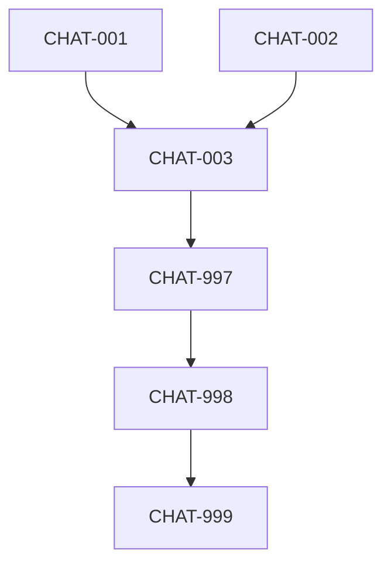

# Story Index - Chat with the Spec

| ID | Title | Status | Type | Dependencies |
|----|-------|--------|------|--------------|
| CHAT-001 | Backend Context Loading | Done | Backend | None |
| CHAT-002 | UI Chat Component | Pending | Frontend | None |
| CHAT-003 | Kanban Integration | Pending | Frontend | CHAT-001, CHAT-002 |
| CHAT-997 | Code Review | Pending | System | All Regular Stories |
| CHAT-998 | Integration Validation | Pending | System | CHAT-997 |
| CHAT-999 | Finalize PR | Pending | System | CHAT-998 |

## Dependency Graph

## Execution Plan
- **Phase 1:** CHAT-001 (Backend) und CHAT-002 (Frontend Component) parallel.
- **Phase 2:** CHAT-003 (Integration) nach Fertigstellung von 1 & 2.
- **Phase 3:** System Stories (997-999).
