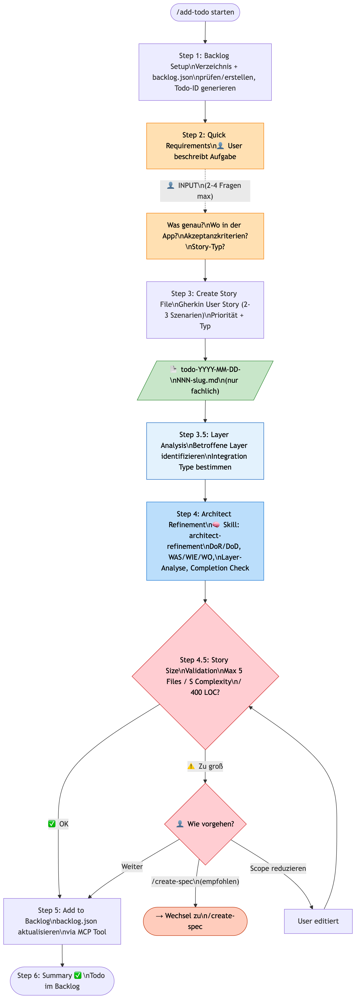

# /add-todo Workflow - Übersicht

> Workflow Version: 2.0
> Dauer: 5-10 Minuten | User-Interaktionen: 1-2 Entscheidungspunkte
> Lightweight Task zum Backlog hinzufügen ohne vollständige Spec-Erstellung

## Flowchart

## Steps

| Step | Name | Beschreibung | Skill / Agent | Rolle |
|------|------|-------------|---------------|-------|
| **1** | Backlog Setup | Verzeichnis + backlog.json prüfen/erstellen, Todo-ID generieren | date-checker | Main |
| **2** | Quick Requirements | Kurzer Dialog (2-4 Fragen max) | — | Main (PO) |
| **3** | Create Story File | Gherkin User Story erstellen (2-3 Szenarien) | — | Main (PO) |
| **3.5** | Layer Analysis | Betroffene Layer identifizieren, Integration Type bestimmen | — | Main |
| **4** | Architect Refinement | Technische Details ergänzen (DoR/DoD, WAS/WIE/WO) | architect-refinement | Main |
| **4.5** | Story Size Validation | Größe prüfen (max 5 Files, max S, max 400 LOC) | — | Main |
| **5** | Add to Backlog | backlog.json aktualisieren via MCP Tool | — | Main |
| **6** | Summary | Bestätigung und nächste Schritte | — | Main |

## Human-in-the-Loop Punkte

| Gate | Step | Was passiert? |
|------|------|--------------|
| **Input** | Step 2 | User beschreibt Aufgabe (Was? Wo? Akzeptanzkriterien?) |
| **Entscheidung** | Step 4.5 | Nur bei zu großer Story: /create-spec / Scope reduzieren / Weiter |

## Output-Dokumente

| Step | Dokument | Pfad | Optional? |
|------|----------|------|-----------|
| 1 | **backlog.json** | `specwright/backlog/backlog.json` | Nein (erstellt wenn nötig) |
| 3 | **todo-[ID]-[slug].md** | `specwright/backlog/stories/` | Nein |
| 5 | **backlog.json** (aktualisiert) | `specwright/backlog/backlog.json` | Nein |

**Gesamt:** 1 Story-Dokument + Backlog Update

## Skills & Agents

| Skill / Agent | Steps | Zweck |
|---------------|-------|-------|
| architect-refinement (Skill) | 4 | Technisches Refinement, DoR/DoD |
| date-checker (Utility) | 1 | Datum für Todo-ID |

## Unterschied zu verwandten Workflows

| Aspekt | /add-todo | /add-bug | /create-spec |
|--------|----------|---------|-------------|
| **Zweck** | Schnelle Aufgabe | Bug-Fix mit RCA | Feature-Spezifikation |
| **Dauer** | 5-10 Min | 15-30 Min | 30-60 Min |
| **Dialog** | 2-4 Fragen | Strukturiert + RCA | Iterativer Dialog |
| **RCA** | Nein | Ja (3 Hypothesen) | Nein |
| **Plan** | Nein | Optional (PlanAgent) | Ja (immer) |
| **Gherkin** | Ja (2-3 Szenarien) | Ja (Bug-Fix-Szenarien) | Ja (2-5+ Szenarien) |
| **Clarification** | Nein | Nein | Ja (eigenes Dokument) |
| **Story Count** | 1 Story | 1 Story | N Stories |
| **Max Complexity** | S | M | Unbegrenzt |
| **Eskalation** | → /create-spec | → /create-spec | — |

## Wann /add-todo verwenden

**Ideal für:**
- Kleine UI-Anpassungen ("Loading State in Modal")
- Minor Bug Fixes (ohne tiefe Analyse nötig)
- Schnelle Enhancements
- Aufgaben die keine volle Spezifikation brauchen
- XS oder S Komplexität

**Stattdessen /create-spec verwenden wenn:**
- Aufgabe erfordert mehrere Stories
- Aufgabe braucht Clarification Document
- Geschätzte Komplexität > S
- Aufgabe betrifft > 5 Dateien
- Aufgabe braucht umfangreiche Anforderungserhebung
- Aufgabe ist ein Major Feature

**Stattdessen /add-bug verwenden wenn:**
- Es handelt sich um einen Bug (Fehlverhalten)
- Root-Cause-Analyse nötig
- Systematische Fehlersuche erforderlich

## Farbkodierung (Diagramm)

| Farbe | Bedeutung |
|-------|-----------|
| Hellblau | Analyse-Schritte (Layer Analysis) |
| Blau | Main Agent mit Skill (Architect Refinement) |
| Orange | User Input |
| Rot/Rosa | Validation / Entscheidungspunkte |
| Grün | Output-Dokumente |
| Rot (dunkel) | Eskalation zu /create-spec |
