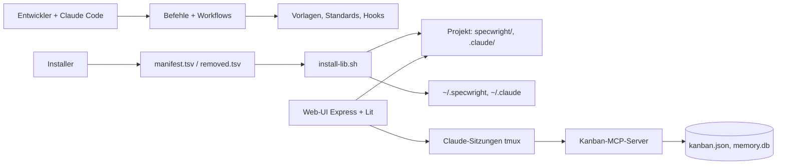

# Architektur: Specwright — Soll

> **Stand:** 2026-09-17, Branch `feat/INT-2026-011-s2` · **Verantwortlich:** Tech Lead (Michael Sindlinger)
> **Rolle dieses Dokuments:** das SOLL. Pflichtinput im Plan Mode. Verschiebt ein Plan eine Grenze, ändert dieselbe PR dieses Dokument.
> **Prinzipien der Firma:** Firmen-Repo SBS (entsteht in Phase 3) — dieses Dokument darf sie konkretisieren, nicht verletzen.

## 1. Überblick

Specwright ist zwei Dinge in einem Repo: ein **Framework** aus Markdown-Befehlen, Workflows, Vorlagen, Standards und Hooks, das Installer in Projekte kopieren, und eine optionale **Web-UI** (Express-Backend, Lit-Frontend), die die Vorhaben der offenen Projekte zeigt, ihre Dokumente lesbar macht, Antworten an wartende Claude-Sitzungen schickt, Sitzungen startet und die Sitzung eines Vorhabens angedockt neben dem Dokument zeigt — das Terminal selbst, kein nachgebauter Verlauf (INT-2026-011, ADR-0004). Ihr Rahmen ist seit INT-2026-010 eine einzige Kopfzeile mit der Glocke (Agent fertig oder wartet), dem Projekt-Symbol und am Handy dem Terminal-Symbol; Chat, Anruf und Team-Seite gibt es nicht mehr. Den Kanban-MCP-Server benutzen nur noch die Sitzungen als Werkzeug; die UI liest und schreibt keine Story-Daten mehr (INT-2026-004, Stufe 3). Daten liegen in den Projekten (Dateien) und für die UI in Laufzeitdateien auf dem Host; es gibt keine zentrale Datenbank.

## 2. Services und Komponenten

| Name | Verantwortung (ein Satz) | Technologie | Pfad / Repo | Owner |
|---|---|---|---|---|
| Befehle | Ein Slash-Befehl je Aufgabe, verweist auf genau einen Workflow | Markdown | `.claude/commands/specwright/` | Michael |
| Workflows | Schrittfolge, die der Hauptagent ausführt (kein Sub-Agent für Kernarbeit) | Markdown | `specwright/workflows/` | Michael |
| Vorlagen und Standards | Dokumentvorlagen (v4: `templates/sdlc/`), Skill-Vorlagen, Coding-Standards mit Hybrid-Lookup | Markdown, JSON | `specwright/templates/`, `specwright/standards/` | Michael |
| Hooks | Deterministische Leitplanken für Claude Code (`PreToolUse`) | Bash + python3 | `specwright/templates/sdlc/hooks/`, im Repo `.claude/hooks/` | Michael |
| Installer | Fünf Skripte mit einer gemeinsamen Bibliothek, lesen das Manifest, schreiben Projekt und Global-Verzeichnisse | Bash 3.2-tauglich | `install.sh`, `setup*.sh`, `update-specwright.sh`, `specwright/scripts/install-lib.sh` | Michael |
| Kanban-MCP-Server | MCP-Werkzeuge für `kanban.json`, Backlog, Memory-Store | TypeScript, `tsx` direkt gestartet | `specwright/scripts/mcp/` | Michael |
| Web-UI Backend | Projekte, Sessions, Cloud-Terminal (tmux; startet auch fremde Agenten-CLIs wie Codex nativ aus der Modell-Config — ohne Hooks, Status und Prüfer-Einsatz; Regel `shared/provider-cli.ts`, INT-2026-012), Vorhaben-Sicht und Review-Kanal (Antworten als Bracketed Paste in die wartende PTY, Bestätigung über den `UserPromptSubmit`-Hook; Freitext nur nach Bildschirmprüfung auf Dialog-Cues unter dem Maschinen-Lock `withMachineWrite`, INT-2026-007), Hook-Route (Status, Blockart, Kontext je Sitzung — kein Transkript-Leser, INT-2026-011; dazu je Sitzung die Marke „fertig, unbeantwortet" für die Glocke, in der Registry bis 24 h, INT-2026-016) als erste Statusquelle **plus Bildschirm-Probe bei Stille als zweite**: eine `working`-Claude-Sitzung, die 1,5 s nichts ausgibt, wird einmal per tmux gelesen; ein Dialog-Cue setzt `blocked` mit Blockart und Herkunft `probe`, ein verschwundener Cue hebt nur einen Probe-Block wieder auf, ein Hook-Ereignis gewinnt immer (INT-2026-016, kein ADR-Wechsel — Bildschirm, nicht Transkript, wie die Sendeprüfung INT-2026-007); **Wiederaufnahme-Regel** (INT-2026-019): das Öffnen der Vorhaben-Seite (`vorhaben:session.resume`) lässt den Vorhaben-Dienst entscheiden, ob die Sitzung der Zeile verloren ist — Zuordnung nicht beendet, Sitzung dem Manager unbekannt —, und startet sie dann über den normalen Startpfad mit `claude --resume <Gesprächskennung>` ohne Eingabe in derselben Arbeitskopie (single-flight je Zeile, Vorprüfung: Transkript-Datei vorhanden, Arbeitskopie vorhanden, Boot-Restore abgeschlossen); **Schutzregel des Aufräumers**: der Sitzungsverwalter bekommt beim Bau zwei Guards (`keepWorktree`, `sessionEnded`) und lässt beim Boot-Reap und im Shutdown saubere Sitzungs-Arbeitskopien stehen, die ein offenes Vorhaben belegen; eine Exit-Datei des Run-Scripts macht ein reguläres Ende während des Stillstands als „beendet" kenntlich (keine Wiederaufnahme); **Nächster Schritt in der Sitzung** (INT-2026-018): die Zeile trägt die Freigabe-Regel des Knopfs (`deriveNextStepSperre` — arbeitet, Dialog, Zustand unbekannt, erste Eingabe unterwegs, Freigabe offen, gleiche oder spätere Phase) und die wiederverwendbare Sitzung; der Klick schreibt `/clear` und den Phasen-Befehl als zwei Bracketed Pastes unter **einem** `withMachineWrite` und wartet dazwischen auf die neue Gesprächskennung aus dem SessionStart-Hook (Zeitüberschreitung = Abbruch mit Meldung, der Befehl geht nie in ein volles Gespräch; vor jedem Paste muss der Bildschirm die leere Eingabezeile ohne Spinner zeigen, `isIdlePrompt`), anderes Modell oder anderes Ziel → neue Sitzung, die alte wird wie per ✕ geschlossen (`closeSession(id, { closedBy: 'user' })`), WebSocket | Express, TypeScript, Claude Code SDK, node-pty | `ui/src/server/` | Michael |
| Web-UI Frontend | Oberfläche als Web Components: Rahmen `aos-kopfzeile` mit `aos-glocke` (INT-2026-010; Einträge seit INT-2026-016 aus dem Backend-Stand der Sitzungen — Dialog oder Marke —, Vorhaben-Zeilen nur als Beschriftung, keine Browser-Merkliste), drei Routen `vorhaben`, `neu`, `projekt` (Aliase der alten Adressen in `route.types.ts`); auf `vorhaben` und `neu` ist die Cloud-Terminal-Sidebar angedockt (`docked`: halbe Breite unter der Kopfzeile ab 1024 px, dieselbe Instanz wie schwebend) und die Kennungen des Dokuments sind im Terminal Verweise (`kennungen.service`, `KennungLinkProvider`, INT-2026-011); Git-Zustand prozesslang in `services/git-state.service.ts`, Git-Leiste und Einstellungen als Abschnitte der Projekt-Seite | Lit, Vite, TypeScript strict | `ui/frontend/src/` (`aos-*`) | Michael |

## 3. Datenbesitz

| Datenobjekt | Besitzer | Speicher | Andere lesen über | Mandantentrennung |
|---|---|---|---|---|
| Vorhaben (`intent/INT-…/`), Projekt-Docs (`docs/`) | Projekt-Repo | Git | Dateisystem | ein Nutzer |
| Lieferumfang | Specwright-Repo | `specwright/manifest.tsv`, `specwright/removed.tsv` | Installer über Raw-URL oder `file://` | — |
| Installierte Version je Projekt | Installer | `specwright/.installed-version` | `check-update.sh` | — |
| `kanban.json`, Backlog | Kanban-MCP-Server | Projekt-Dateien | MCP-Werkzeuge der Sitzungen (die UI liest nicht mehr, INT-2026-004) | — |
| Memory-Store | Kanban-MCP-Server | `~/.specwright/memory.db` (SQLite) | MCP-Werkzeuge `memory_*` | — |
| Workspace der UI (offene Projekte, Tabs) | UI-Backend | `<runtime>/workspace-<port>.json` | WebSocket `workspace:*` | pro Backend-Instanz |
| Nutzerzustand der UI (Zuordnung Sitzung↔Vorhaben — eine Sitzung gehört höchstens einem Vorhaben: ein getippter Phasen-Befehl, ein neuer Ordner oder der Klick „Nächster Schritt" in einer ruhig wartenden Sitzung einer früheren Phase verschiebt sie (INT-2026-018), ein Klick im angedockten Terminal oder „Neue Session" dort bindet einen freien Claude-Tab (`vorhaben:session.assign`), INT-2026-016 —, auch anhängige Absicht-Sitzungen ohne Ordner und ihre Freitext-Einträge bis zum Claim des Ordners — INT-2026-008; Anmerkungs-Entwürfe, Protokoll inkl. Freitext-Einträgen, letzte Modellwahl, Doc-Entwürfe; **Ansicht** — gewählter Projekt-Chip der Liste und gewähltes Phasen-Dokument je Vorhaben, gesetzt über `vorhaben:ansicht.set`, im Snapshot als `ansicht`; **erste Eingabe** je gestarteter Sitzung — Text von „Neue Absicht" oder eine Freigabe — bis zur Zustellung beim ersten Stop der Sitzung, im Snapshot nur als Flag `firstInputPending`, nie als Text — INT-2026-010; die Zuordnung trägt seit INT-2026-019 den **Provider**, die **Claude-Gesprächskennung** aus dem SessionStart-Hook (UUID-geprüft; nur `--resume`-Argument und Dateiname der Existenzprüfung, weiterhin kein Transkript-Leser, ADR-0004) und die **Wiederaufnahme-Marke** `resumed` (im Snapshot als `session.resumed`, die Seite zeigt „fortgesetzt nach Neustart · Stand HH:MM")) | UI-Backend | `<runtime>/vorhaben-<port>.json` (ADR-0002) | WebSocket `vorhaben:*` (inkl. `pendingIntents`, `ansicht`), `project-docs:*` | pro Backend-Instanz |
| Terminal-Sitzungen (inkl. Hook-Kontext: Transkriptpfad und Claude-Session-ID — gespeichert, ohne Leser, ADR-0004 —, Blockart, Plan-Review-Schalter) | UI-Backend | tmux-Server + Disk-Registry | WebSocket | pro Host |
| Bilder aus „Neue Absicht" (Zwischenablage vor der Sitzung, INT-2026-020) | UI-Backend | `<runtime>/intent-paste/img-<uuid>.<ext>` (`0600`; nicht unter `paste/`, das Sitzungen mit sich löschen), ADR-0005 | absoluter Pfad im Text der ersten Eingabe der Sitzung (`firstInput`) | pro Backend-Instanz/Host; Löschfrist 7 Tage, Aufräumen beim Start |

## 4. Erlaubte Abhängigkeiten

| ID | Regel | Grund | Prüfung |
|---|---|---|---|
| AR-01 | Kein Installer führt eine eigene Dateiliste; alle lesen `specwright/manifest.tsv` über `install-lib.sh`. | Installer-Drift war zweimal die Ursache fehlender Befehle | `scripts/check-manifest.sh` (c) in CI |
| AR-02 | MCP-Server werden direkt gestartet (`$MCP_DIR/node_modules/.bin/tsx …`), nie über `npx`. | `npx` spawnt eine 3–4-Prozess-Kette je Server; RAM/Swap auf dem Droplet | `scripts/check-mcp-launcher.sh` |
| AR-03 | Innerhalb des Kanban-MCP-Servers (`specwright/scripts/mcp/`): Git-Operationen am Hauptrepo unter `withMainProjectLock` (außen), `kanban.json`-Schreiben unter `withKanbanLock` (innen); nie umgekehrt. Die UI schreibt keine Story-Daten mehr; ihr Hauptrepo-Lock (`ui/src/server/utils/main-project-mutex.ts`) sichert nur noch das Anlegen von Session-Worktrees. | ABBA-Deadlock zwischen Prozessen, die dieselben Dateien halten | Review; `specwright/scripts/mcp/kanban-lock.ts` |
| AR-04 | Server-Code kennt Projektverzeichnisse nur über `projectDir()`/`projectDotDir()` (`ui/src/server/utils/project-dirs.ts`); nie `specwright/` oder `agent-os/` hart kodiert. | Rückwärtskompatibilität alter Projekte | Import-Scan, Review |
| AR-05 | Workspace- **und Nutzerzustand** der UI (Projekte, Recents, Tab-Namen; Zuordnung Sitzung↔Vorhaben, Entwürfe, Protokoll) lebt im Backend und wird als Ganzes gebroadcastet; nie in `localStorage`. | Gleiche Sicht auf jedem Gerät | Review; Tests `ui/tests/unit/vorhaben-state.test.ts`, `workspace-handler.test.ts` |
| AR-06 | Framework-Änderungen dürfen nie von der Web-UI abhängen; die UI ist optional. | Installierbar ohne Node | Installer-Test läuft ohne `ui/` |
| AR-07 | Vorhaben und Projekt-Docs liegen im Repo-Root (`intent/`, `docs/`); `specwright/` enthält nur Werkzeug. | Produkt-Artefakte müssen ohne Specwright-Kenntnis auffindbar sein (B-07, INT-2026-002) | Review |

**Verboten, ausdrücklich:** Befehle oder Workflows, die Sub-Agenten für Kernarbeit delegieren (Kontextverlust); Secrets in Vorlagen oder Installern; Änderungen an Tests oder Bezugslisten, damit etwas grün wird; Droplet-Hostnamen, Pfade oder Tokens in diesem öffentlichen Repo.

## 5. Externe Systeme

| System | Wofür | Aufruf aus | Ausfall bedeutet | Zugang liegt in |
|---|---|---|---|---|
| GitHub Raw (`raw.githubusercontent.com/michsindlinger/specwright/main`) | Quelle aller Installer-Downloads | Installer | Installation unmöglich (`curl -f` bricht ab); Tests nutzen `file://` | öffentlich |
| GitHub Actions | CI (`scripts/verify.sh`) | Push/PR | kein Tor — lokal grün zählt dann nicht | Repo |
| Claude Code SDK / CLI | Sitzungen aus der UI | UI-Backend | UI ohne Agent | `security.md` §3 |
| Cloud-Host (Linux, systemd, Auto-Deploy bei Push auf `main`) | Web-UI im Betrieb; der Deploy-Timer fragt vor dem Neustart `GET /api/status/deploy-readiness` und wartet bei 423 (eine gesendete, noch unbestätigte Review-Antwort — höchstens 10 s) | — | UI nicht erreichbar; Framework unbetroffen | außerhalb des Repos |

## 6. Tech-Stack

| Schicht | Technologie | Version | Pinning |
|---|---|---|---|
| Framework | Markdown, Bash | Bash ≥ 3.2 (macOS) | keine Bash-4-Features in Installern |
| MCP-Server | TypeScript über `tsx` | `tsx` exakt `4.21.0` im MCP-Verzeichnis | exakt |
| UI-Backend | Node ≥ 20, Express, ws, node-pty | `ui/package.json` | caret |
| UI-Frontend | Lit, Vite, TypeScript strict | `ui/frontend/package.json` | caret |
| Tests | Vitest (UI), Bash-Tests (Installer) | — | — |

## 7. Projektspezifische Prinzipien

- **AP-01:** Der Hauptagent führt Workflows selbst aus; Utility-Agenten (`context-fetcher`, `file-creator`, `git-workflow`, `date-checker`) nur für kontextfreie Handgriffe. — Grund: Sub-Agenten verlieren den Plan-Kontext (Migration 2026-02).
- **AP-02:** Ein Bruch im Lieferumfang ist erlaubt (nur ein Nutzer), aber nie ohne Update-Weg und Versionssprung (`removed.tsv`, Major-Version). — Grund: Altprojekte müssen ohne Handarbeit nachziehen können.
- **AP-03:** CI ist die Wahrheit für „grün"; lokale Läufe sind Vorprüfung. — Grund: Pilot INT-2026-001 (lokal grün, CI rot).
- **AP-04:** Ziel, noch nicht gelebt: Drift-Erkennung (§9) läuft nur für Manifest und MCP-Launcher, nicht für UI-Abhängigkeiten.

## 8. Entscheidungen

- ADR-Ordner: `docs/adr/` (bestehend; die Vorlage nennt `docs/decisions/` — hier gewinnt der vorhandene Ordner).
- Entscheidungen, die dieses Soll geprägt haben: Gesamtplan `AI-native-SDLC-Plan-2026-09-13` (D1–D13), INT-2026-002 (Manifest, Bibliothek, harter Schnitt, Root-Ablage), ADR-0002 (Nutzerzustand der UI als Laufzeitdatei, INT-2026-004), ADR-0004 (die Sitzung wird gezeigt, nicht nachgelesen — löst ADR-0003 ab, INT-2026-011), ADR-0005 (Bilder aus „Neue Absicht" im Laufzeitverzeichnis, sieben Tage, INT-2026-020).

## 9. Drift-Erkennung

- **Skript:** `scripts/verify.sh` — ruft `scripts/check-manifest.sh` (AR-01) und `scripts/check-mcp-launcher.sh` (AR-02); läuft lokal und in `.github/workflows/verify.yml`.
- **Quelle des Ist:** Dateisystem des Repos (Lieferverzeichnisse), Installer-Quelltext.
- **Geprüfte Regeln:** AR-01, AR-02. AR-03 bis AR-07 nur per Review (AP-04).
- **Bei Verstoß:** PR rot; Befund als Karte im Board Specwright oder als `intent.md`.

## 10. Bekannte Abweichungen (Ist ≠ Soll)

| Abweichung | Regel | Seit | Karte / Intent | Plan |
|---|---|---|---|---|
| `specwright/mcp-profiles/` (Profile `execute-tasks`, `create-spec`, `validate-market`) hat seit INT-2026-004 Stufe 3 keinen Leser mehr in der UI (`mcp-profile.ts` entfernt); Profil-Dateien und README bleiben liegen | — | 2026-09-15 | Aufräum-Karte | separates Vorhaben (Kanban-MCP-Abbau, NZ-02) |
| `workflow.*`-Handler in `ui/src/server/websocket.ts` und der PTY-Pfad in `workflow-executor.ts` haben nach Stufe 3 keinen Frontend-Aufrufer mehr (Team/Getting Started laufen über `cloud-terminal:create-workflow`) | — | 2026-09-15 | Aufräum-Karte | separates Vorhaben |
| `terminal.*`-Handler (`terminal.input`, `terminal.resize`, `terminal.buffer.request`) in `websocket.ts` und ihre Sender in `gateway.ts` gehören zum Nicht-Cloud-Modus von `aos-terminal.ts` (`cloudMode = false`), den kein Aufrufer mehr setzt | — | 2026-09-16 | Aufräum-Karte | separates Vorhaben (INT-2026-010 Plan §2) |
| `views/team-view.ts` und `components/team/*` bleiben ohne Route kompilierbar (NZ-03, INT-2026-010); der Link `#/call/…` dort ist tot (Alias → Liste), `settings.voice.get` wird vom Backend nur noch mit `ack` beantwortet | — | 2026-09-16 | Aufräum-Karte | separates Vorhaben |
| `specwright/templates/agents/` (8 Vorlagen) und einige Agenten/Skills werden von keinem Workflow referenziert | — | 2026-09-14 | Aufräum-Karte | separates Vorhaben |
| Terminal-Layout der Cloud-Terminal-Sidebar (Breite `cloud-terminal-sidebar-width`, Layout-Modus, Pane-Sitzungen und -Projekte, Split-Verhältnisse) liegt in `localStorage` des Browsers, nicht im Backend; das Andocken (INT-2026-011) leitet sich aus Route und Fensterbreite ab und speichert nichts Neues | AR-05 | 2026-06 (Split-Panes, PR #31) | Aufräum-Karte | separates Vorhaben: in den Workspace-Zustand heben oder als gerätelokal (Breite je Fenster) ausdrücklich ausnehmen |
| Specwright trägt eigene v3-Artefakte (`specwright/{specs,product,brainstorming,knowledge}`) | AR-07 | 2026-02 | Aufräum-Karte | archivieren wie bei Applai |

## Änderungsprotokoll

| Datum | Änderung | PR / ADR |
|---|---|---|
| 2026-09-14 | Erstfassung (INT-2026-002) | PR #38 |
| 2026-09-15 | §3 Nutzerzustand der UI, AR-05 erweitert (INT-2026-004, Stufe 1) | ADR-0002 |
| 2026-09-15 | §2 Backend-Zeile um Vorhaben-Sicht/Review-Kanal, §5 Deploy-Gate um unbestätigte Review-Antworten (INT-2026-004, Stufe 2) | PR #45 |
| 2026-09-16 | §2 Backend-Zeile um Gespräch (Transkript-Leser, Lock), §3 Terminal-Sitzungen um Hook-Kontext, neue Zeile Sitzungsverlauf, Nutzerzustand um Freitext-Protokoll (INT-2026-007, Stufe 1) | ADR-0003 |
| 2026-09-16 | §3 Nutzerzustand: anhängige Absicht-Sitzungen ohne Ordner werden mit `vorhaben:state` ausgeliefert, ihre Freitext-Einträge tragen die Kennung erst ab dem Claim (INT-2026-008); keine AR-Änderung | PR #54 |
| 2026-09-15 | Story-Pfad aus der UI entfernt: §1 Diagramm und Text (UI → MCP nur noch über Sitzungen), §2 ohne Auto-Mode, §3 `kanban.json` ohne UI-Leser, AR-03 auf den MCP-Server beschränkt, §5 Gate ohne Auto-Mode, §10 Zeile „Story pro Session" erledigt, zwei neue Abweichungen (INT-2026-004, Stufe 3) | PR #46 |
| 2026-09-16 | §1 Rahmen (Kopfzeile mit Glocke, kein Chat/Anruf/Team), §2 Frontend-Zeile (Routen `vorhaben`, `neu`, `projekt`; Git-Dienst; Projekt-Seite als Wirt), §10 zwei Bestandszeilen (`terminal.*`-Handler, Team-View ohne Route); Chat-, Voice- und Bild-Upload-Backend entfernt — keine AR-Änderung (INT-2026-010, Stufe 1) | PR #57 |
| 2026-09-16 | §3 Nutzerzustand um die Ansicht (Projekt-Chip, Phasen-Dokument je Vorhaben; `vorhaben:ansicht.set`) und die erste Eingabe je gestarteter Sitzung (Zustellung beim ersten Stop, nur Flag im Snapshot) erweitert; `start-step` ohne Modell löst lastModel → Schritt-Standard der Einstellungen — keine AR-Änderung, AR-05 eingehalten (INT-2026-010, Stufe 2) | PR #58 |
| 2026-09-16 | §2 Backend-Zeile: Cloud-Terminal startet auch fremde Agenten-CLIs (Codex nativ) aus der Modell-Config, ohne Hooks, Status und Prüfer; die Sitzungsart folgt einer Regel (`ui/src/shared/provider-cli.ts`, Basisname `claude…`), keine AR-Änderung, kein neues Datenobjekt (INT-2026-012) | PR #62 |
| 2026-09-17 | §2 Backend: Marke „fertig, unbeantwortet" je Sitzung (Registry, 24 h); §2 Frontend: Glocke aus dem Backend-Stand, Browser-Merkliste entfernt — keine AR-Änderung, AR-05 eingehalten (INT-2026-016, PR 1) | PR #73 |
| 2026-09-17 | §3 Nutzerzustand: Zuordnung wandert mit der Sitzung (Befehl, Ordner), Klick/„Neue Session" im angedockten Terminal bindet (`vorhaben:session.assign`); Arbeitskopie einer Zeile nach Inhalt statt Datei-Datum — keine AR-Änderung (INT-2026-016, PR 2) | PR #74 |
| 2026-09-17 | §2 Backend: Bildschirm-Probe bei Stille als zweite Statusquelle neben der Hook-Route, Herkunft `blockedBy` in der Registry — keine AR-Änderung, ADR-0004 unverändert (INT-2026-016, PR 3) | PR #75 |
| 2026-09-18 | §2 Backend: Wiederaufnahme-Regel (`vorhaben:session.resume` → `claude --resume` über den normalen Startpfad) und Schutzregel des Aufräumers (Guards `keepWorktree`, `sessionEnded`; Exit-Datei als Ende-Signal im Stillstand); §3 Nutzerzustand: Zuordnung trägt Provider, Claude-Gesprächskennung und Wiederaufnahme-Marke — keine AR-Änderung, AR-05 eingehalten, ADR-0004 unverändert (kein Transkript-Leser), Erweiterung von ADR-0002 um optionale Felder (INT-2026-019) | PR #77 |
| 2026-09-17 | Terminal statt Gespräch: §1 Sitzung angedockt neben dem Dokument, §2 Backend ohne Gespräch und Transkript-Leser (Hook-Route liefert Status, Blockart, Kontext), §2 Frontend mit angedockter Sidebar und Kennungs-Verweisen, §3 Zeile „Sitzungsverlauf" entfernt, Hook-Kontext bleibt gespeichert ohne Leser, §8 ADR-0004, §10 Bestandszeile Terminal-Layout in `localStorage` (AR-05) — keine AR-Änderung (INT-2026-011, Stufe 1 PR #65, Stufe 2) | ADR-0004 |
| 2026-09-18 | §2 Backend: „Nächster Schritt in der Sitzung" (Freigabe-Regel `deriveNextStepSperre`, `/clear` + Phasen-Befehl unter einem Maschinen-Lock mit Warten auf die neue Gesprächskennung, Schließen der alten Sitzung als Nutzer); §3 Nutzerzustand: der Klick verschiebt die Zuordnung wie ein getippter Befehl — keine AR-Änderung, AR-02/AR-04/AR-05 eingehalten, ADR-0002 und ADR-0004 unverändert (INT-2026-018) | PR #82 |
| 2026-09-18 | §3 neue Zeile „Bilder aus „Neue Absicht"" (`<runtime>/intent-paste/`, 7 Tage, beim Start aufgeräumt; Prüf- und Ablagefunktion mit dem Terminal geteilt), §8 ADR-0005 — keine AR-Änderung, AR-04/AR-05 eingehalten, ADR-0002 unverändert (INT-2026-020) | ADR-0005, PR #79 |
