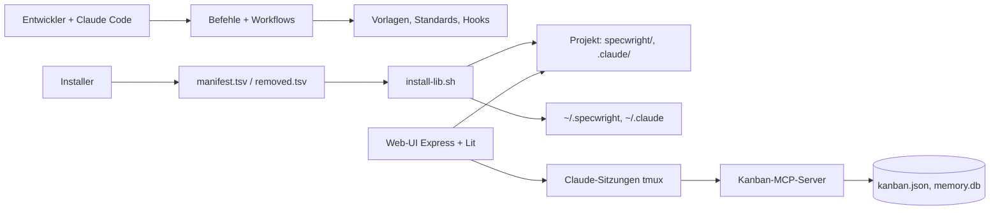

# Architektur: Specwright — Soll

> **Stand:** 2026-09-15, Branch `feat/INT-2026-004-ui-s3` · **Verantwortlich:** Tech Lead (Michael Sindlinger)
> **Rolle dieses Dokuments:** das SOLL. Pflichtinput im Plan Mode. Verschiebt ein Plan eine Grenze, ändert dieselbe PR dieses Dokument.
> **Prinzipien der Firma:** Firmen-Repo SBS (entsteht in Phase 3) — dieses Dokument darf sie konkretisieren, nicht verletzen.

## 1. Überblick

Specwright ist zwei Dinge in einem Repo: ein **Framework** aus Markdown-Befehlen, Workflows, Vorlagen, Standards und Hooks, das Installer in Projekte kopieren, und eine optionale **Web-UI** (Express-Backend, Lit-Frontend), die die Vorhaben der offenen Projekte zeigt, ihre Dokumente lesbar macht, Antworten an wartende Claude-Sitzungen schickt und Sitzungen startet. Den Kanban-MCP-Server benutzen nur noch die Sitzungen als Werkzeug; die UI liest und schreibt keine Story-Daten mehr (INT-2026-004, Stufe 3). Daten liegen in den Projekten (Dateien) und für die UI in Laufzeitdateien auf dem Host; es gibt keine zentrale Datenbank.

## 2. Services und Komponenten

| Name | Verantwortung (ein Satz) | Technologie | Pfad / Repo | Owner |
|---|---|---|---|---|
| Befehle | Ein Slash-Befehl je Aufgabe, verweist auf genau einen Workflow | Markdown | `.claude/commands/specwright/` | Michael |
| Workflows | Schrittfolge, die der Hauptagent ausführt (kein Sub-Agent für Kernarbeit) | Markdown | `specwright/workflows/` | Michael |
| Vorlagen und Standards | Dokumentvorlagen (v4: `templates/sdlc/`), Skill-Vorlagen, Coding-Standards mit Hybrid-Lookup | Markdown, JSON | `specwright/templates/`, `specwright/standards/` | Michael |
| Hooks | Deterministische Leitplanken für Claude Code (`PreToolUse`) | Bash + python3 | `specwright/templates/sdlc/hooks/`, im Repo `.claude/hooks/` | Michael |
| Installer | Fünf Skripte mit einer gemeinsamen Bibliothek, lesen das Manifest, schreiben Projekt und Global-Verzeichnisse | Bash 3.2-tauglich | `install.sh`, `setup*.sh`, `update-specwright.sh`, `specwright/scripts/install-lib.sh` | Michael |
| Kanban-MCP-Server | MCP-Werkzeuge für `kanban.json`, Backlog, Memory-Store | TypeScript, `tsx` direkt gestartet | `specwright/scripts/mcp/` | Michael |
| Web-UI Backend | Projekte, Sessions, Cloud-Terminal (tmux), Vorhaben-Sicht und Review-Kanal (Antworten als Bracketed Paste in die wartende PTY, Bestätigung über den `UserPromptSubmit`-Hook), Gespräch (Sitzungsverlauf aus Hooks und Claude-Code-Transkript, Abo je Sitzung; Freitext nur nach Bildschirmprüfung auf Dialog-Cues unter dem Maschinen-Lock `withMachineWrite`, INT-2026-007), WebSocket | Express, TypeScript, Claude Code SDK, node-pty | `ui/src/server/` | Michael |
| Web-UI Frontend | Oberfläche als Web Components | Lit, Vite, TypeScript strict | `ui/frontend/src/` (`aos-*`) | Michael |

## 3. Datenbesitz

| Datenobjekt | Besitzer | Speicher | Andere lesen über | Mandantentrennung |
|---|---|---|---|---|
| Vorhaben (`intent/INT-…/`), Projekt-Docs (`docs/`) | Projekt-Repo | Git | Dateisystem | ein Nutzer |
| Lieferumfang | Specwright-Repo | `specwright/manifest.tsv`, `specwright/removed.tsv` | Installer über Raw-URL oder `file://` | — |
| Installierte Version je Projekt | Installer | `specwright/.installed-version` | `check-update.sh` | — |
| `kanban.json`, Backlog | Kanban-MCP-Server | Projekt-Dateien | MCP-Werkzeuge der Sitzungen (die UI liest nicht mehr, INT-2026-004) | — |
| Memory-Store | Kanban-MCP-Server | `~/.specwright/memory.db` (SQLite) | MCP-Werkzeuge `memory_*` | — |
| Workspace der UI (offene Projekte, Tabs) | UI-Backend | `<runtime>/workspace-<port>.json` | WebSocket `workspace:*` | pro Backend-Instanz |
| Nutzerzustand der UI (Zuordnung Sitzung↔Vorhaben, Anmerkungs-Entwürfe, Protokoll inkl. Freitext-Einträgen des Gesprächs, letzte Modellwahl, Doc-Entwürfe) | UI-Backend | `<runtime>/vorhaben-<port>.json` (ADR-0002) | WebSocket `vorhaben:*`, `project-docs:*` | pro Backend-Instanz |
| Terminal-Sitzungen (inkl. Hook-Kontext: Transkriptpfad, Claude-Session-ID, Blockart, Plan-Review-Schalter) | UI-Backend | tmux-Server + Disk-Registry | WebSocket | pro Host |
| Sitzungsverlauf (Transkript einer Claude-Code-Sitzung) | Claude Code | `~/.claude*/projects/<slug>/<session-id>.jsonl` | UI-Backend liest nur (Tailer, Allowlist der Config-Verzeichnisse, ADR-0003), keine Kopie; Clients über WebSocket `gespraech:*` je Sitzung | pro Host |

## 4. Erlaubte Abhängigkeiten

| ID | Regel | Grund | Prüfung |
|---|---|---|---|
| AR-01 | Kein Installer führt eine eigene Dateiliste; alle lesen `specwright/manifest.tsv` über `install-lib.sh`. | Installer-Drift war zweimal die Ursache fehlender Befehle | `scripts/check-manifest.sh` (c) in CI |
| AR-02 | MCP-Server werden direkt gestartet (`$MCP_DIR/node_modules/.bin/tsx …`), nie über `npx`. | `npx` spawnt eine 3–4-Prozess-Kette je Server; RAM/Swap auf dem Droplet | `scripts/check-mcp-launcher.sh` |
| AR-03 | Innerhalb des Kanban-MCP-Servers (`specwright/scripts/mcp/`): Git-Operationen am Hauptrepo unter `withMainProjectLock` (außen), `kanban.json`-Schreiben unter `withKanbanLock` (innen); nie umgekehrt. Die UI schreibt keine Story-Daten mehr; ihr Hauptrepo-Lock (`ui/src/server/utils/main-project-mutex.ts`) sichert nur noch das Anlegen von Session-Worktrees. | ABBA-Deadlock zwischen Prozessen, die dieselben Dateien halten | Review; `specwright/scripts/mcp/kanban-lock.ts` |
| AR-04 | Server-Code kennt Projektverzeichnisse nur über `projectDir()`/`projectDotDir()` (`ui/src/server/utils/project-dirs.ts`); nie `specwright/` oder `agent-os/` hart kodiert. | Rückwärtskompatibilität alter Projekte | Import-Scan, Review |
| AR-05 | Workspace- **und Nutzerzustand** der UI (Projekte, Recents, Tab-Namen; Zuordnung Sitzung↔Vorhaben, Entwürfe, Protokoll) lebt im Backend und wird als Ganzes gebroadcastet; nie in `localStorage`. | Gleiche Sicht auf jedem Gerät | Review; Tests `ui/tests/unit/vorhaben-state.test.ts`, `workspace-handler.test.ts` |
| AR-06 | Framework-Änderungen dürfen nie von der Web-UI abhängen; die UI ist optional. | Installierbar ohne Node | Installer-Test läuft ohne `ui/` |
| AR-07 | Vorhaben und Projekt-Docs liegen im Repo-Root (`intent/`, `docs/`); `specwright/` enthält nur Werkzeug. | Produkt-Artefakte müssen ohne Specwright-Kenntnis auffindbar sein (B-07, INT-2026-002) | Review |

**Verboten, ausdrücklich:** Befehle oder Workflows, die Sub-Agenten für Kernarbeit delegieren (Kontextverlust); Secrets in Vorlagen oder Installern; Änderungen an Tests oder Bezugslisten, damit etwas grün wird; Droplet-Hostnamen, Pfade oder Tokens in diesem öffentlichen Repo.

## 5. Externe Systeme

| System | Wofür | Aufruf aus | Ausfall bedeutet | Zugang liegt in |
|---|---|---|---|---|
| GitHub Raw (`raw.githubusercontent.com/michsindlinger/specwright/main`) | Quelle aller Installer-Downloads | Installer | Installation unmöglich (`curl -f` bricht ab); Tests nutzen `file://` | öffentlich |
| GitHub Actions | CI (`scripts/verify.sh`) | Push/PR | kein Tor — lokal grün zählt dann nicht | Repo |
| Claude Code SDK / CLI | Sitzungen aus der UI | UI-Backend | UI ohne Agent | `security.md` §3 |
| Cloud-Host (Linux, systemd, Auto-Deploy bei Push auf `main`) | Web-UI im Betrieb; der Deploy-Timer fragt vor dem Neustart `GET /api/status/deploy-readiness` und wartet bei 423 (eine gesendete, noch unbestätigte Review-Antwort — höchstens 10 s) | — | UI nicht erreichbar; Framework unbetroffen | außerhalb des Repos |

## 6. Tech-Stack

| Schicht | Technologie | Version | Pinning |
|---|---|---|---|
| Framework | Markdown, Bash | Bash ≥ 3.2 (macOS) | keine Bash-4-Features in Installern |
| MCP-Server | TypeScript über `tsx` | `tsx` exakt `4.21.0` im MCP-Verzeichnis | exakt |
| UI-Backend | Node ≥ 20, Express, ws, node-pty | `ui/package.json` | caret |
| UI-Frontend | Lit, Vite, TypeScript strict | `ui/frontend/package.json` | caret |
| Tests | Vitest (UI), Bash-Tests (Installer) | — | — |

## 7. Projektspezifische Prinzipien

- **AP-01:** Der Hauptagent führt Workflows selbst aus; Utility-Agenten (`context-fetcher`, `file-creator`, `git-workflow`, `date-checker`) nur für kontextfreie Handgriffe. — Grund: Sub-Agenten verlieren den Plan-Kontext (Migration 2026-02).
- **AP-02:** Ein Bruch im Lieferumfang ist erlaubt (nur ein Nutzer), aber nie ohne Update-Weg und Versionssprung (`removed.tsv`, Major-Version). — Grund: Altprojekte müssen ohne Handarbeit nachziehen können.
- **AP-03:** CI ist die Wahrheit für „grün"; lokale Läufe sind Vorprüfung. — Grund: Pilot INT-2026-001 (lokal grün, CI rot).
- **AP-04:** Ziel, noch nicht gelebt: Drift-Erkennung (§9) läuft nur für Manifest und MCP-Launcher, nicht für UI-Abhängigkeiten.

## 8. Entscheidungen

- ADR-Ordner: `docs/adr/` (bestehend; die Vorlage nennt `docs/decisions/` — hier gewinnt der vorhandene Ordner).
- Entscheidungen, die dieses Soll geprägt haben: Gesamtplan `AI-native-SDLC-Plan-2026-09-13` (D1–D13), INT-2026-002 (Manifest, Bibliothek, harter Schnitt, Root-Ablage), ADR-0002 (Nutzerzustand der UI als Laufzeitdatei, INT-2026-004).

## 9. Drift-Erkennung

- **Skript:** `scripts/verify.sh` — ruft `scripts/check-manifest.sh` (AR-01) und `scripts/check-mcp-launcher.sh` (AR-02); läuft lokal und in `.github/workflows/verify.yml`.
- **Quelle des Ist:** Dateisystem des Repos (Lieferverzeichnisse), Installer-Quelltext.
- **Geprüfte Regeln:** AR-01, AR-02. AR-03 bis AR-07 nur per Review (AP-04).
- **Bei Verstoß:** PR rot; Befund als Karte im Board Specwright oder als `intent.md`.

## 10. Bekannte Abweichungen (Ist ≠ Soll)

| Abweichung | Regel | Seit | Karte / Intent | Plan |
|---|---|---|---|---|
| `specwright/mcp-profiles/` (Profile `execute-tasks`, `create-spec`, `validate-market`) hat seit INT-2026-004 Stufe 3 keinen Leser mehr in der UI (`mcp-profile.ts` entfernt); Profil-Dateien und README bleiben liegen | — | 2026-09-15 | Aufräum-Karte | separates Vorhaben (Kanban-MCP-Abbau, NZ-02) |
| `workflow.*`-Handler in `ui/src/server/websocket.ts` und der PTY-Pfad in `workflow-executor.ts` haben nach Stufe 3 keinen Frontend-Aufrufer mehr (Team/Getting Started laufen über `cloud-terminal:create-workflow`) | — | 2026-09-15 | Aufräum-Karte | separates Vorhaben |
| `specwright/templates/agents/` (8 Vorlagen) und einige Agenten/Skills werden von keinem Workflow referenziert | — | 2026-09-14 | Aufräum-Karte | separates Vorhaben |
| Specwright trägt eigene v3-Artefakte (`specwright/{specs,product,brainstorming,knowledge}`) | AR-07 | 2026-02 | Aufräum-Karte | archivieren wie bei Applai |

## Änderungsprotokoll

| Datum | Änderung | PR / ADR |
|---|---|---|
| 2026-09-14 | Erstfassung (INT-2026-002) | PR folgt |
| 2026-09-15 | §3 Nutzerzustand der UI, AR-05 erweitert (INT-2026-004, Stufe 1) | ADR-0002 |
| 2026-09-15 | §2 Backend-Zeile um Vorhaben-Sicht/Review-Kanal, §5 Deploy-Gate um unbestätigte Review-Antworten (INT-2026-004, Stufe 2) | PR #45 |
| 2026-09-16 | §2 Backend-Zeile um Gespräch (Transkript-Leser, Lock), §3 Terminal-Sitzungen um Hook-Kontext, neue Zeile Sitzungsverlauf, Nutzerzustand um Freitext-Protokoll (INT-2026-007, Stufe 1) | ADR-0003 |
| 2026-09-15 | Story-Pfad aus der UI entfernt: §1 Diagramm und Text (UI → MCP nur noch über Sitzungen), §2 ohne Auto-Mode, §3 `kanban.json` ohne UI-Leser, AR-03 auf den MCP-Server beschränkt, §5 Gate ohne Auto-Mode, §10 Zeile „Story pro Session" erledigt, zwei neue Abweichungen (INT-2026-004, Stufe 3) | PR #46 |
