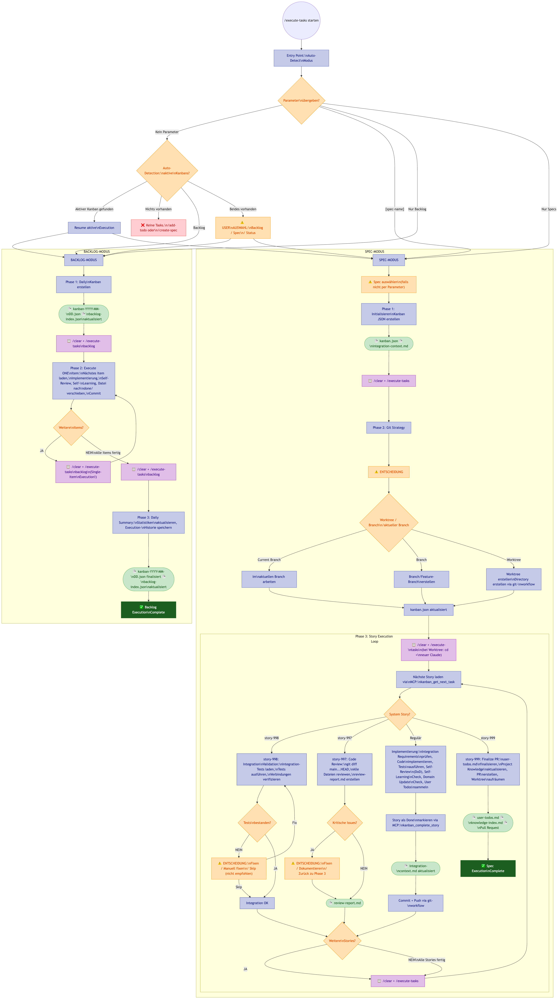

# /execute-tasks Workflow - Übersicht

> Workflow Version: 4.1 (Entry Point) / 5.0 (Spec Phase 3)
> Architektur: Phasen-basiert mit /clear zwischen Phasen für Context-Optimierung
> Zwei Modi: Spec-Execution und Backlog-Execution

## Flowchart

---

## Entry Point: Modus-Erkennung

| Aufruf | Modus |
|--------|-------|
| `/execute-tasks` | Auto-Detect (aktiver Kanban, Backlog, Specs) |
| `/execute-tasks backlog` | Backlog-Modus |
| `/execute-tasks [spec-name]` | Spec-Modus für bestimmte Spec |

Der Entry Point ist ein leichtgewichtiger Router, der den aktuellen Zustand erkennt und **nur die relevante Phase-Datei** lädt (~100-200 Zeilen statt 1600). Dadurch ~70-80% Context-Einsparung.

---

## SPEC-MODUS

### Phasen-Übersicht

| Phase | Datei | Beschreibung | Agents | Skill |
|-------|-------|-------------|--------|-------|
| **1** | spec-phase-1.md | Initialize: Kanban JSON erstellen, Stories parsen | file-creator | — |
| **2** | spec-phase-2.md | Git Strategy: Worktree / Branch / Current Branch | git-workflow | — |
| **3** | spec-phase-3.md | Execute Story: Eine Story komplett implementieren (Loop, inkl. System Stories 997-999) | git-workflow | Auto-load via Globs |

### Phase 1: Initialize

- Spec auswählen (per Parameter oder interaktiv)
- Kanban JSON erstellen/validieren via MCP Tool `kanban_create`
- Stories aus `stories/` Verzeichnis parsen (ID, Typ, Priority, Dependencies)
- DoR validieren (alle Checkboxen [x] = ready, sonst blocked)
- `integration-context.md` erstellen (file-creator)

**Output:**
| Dokument | Pfad |
|----------|------|
| kanban.json | `specwright/specs/[spec]/kanban.json` |
| integration-context.md | `specwright/specs/[spec]/integration-context.md` |

### Phase 2: Git Strategy Setup

- User wählt Git-Strategie:
  - **Worktree** (Recommended): Isoliertes Verzeichnis außerhalb des Projekts
  - **Branch**: Neuer Feature-Branch im Hauptverzeichnis
  - **Current Branch**: Direkt im aktuellen Branch arbeiten
- Bei Worktree: Uncommitted Changes committen, Worktree erstellen, User muss `cd` + neuen Claude starten
- Git-Strategie via MCP Tool `kanban_set_git_strategy` speichern

**Output:**
| Dokument | Pfad |
|----------|------|
| kanban.json (Update) | `specwright/specs/[spec]/kanban.json` |

### Phase 3: Execute Story (Loop)

Wird pro Story einmal durchlaufen. Zwischen Stories: `/clear` + `/execute-tasks`.

#### Reguläre Stories

| Schritt | Beschreibung |
|---------|-------------|
| Load Next Task | Via MCP `kanban_get_next_task` (86% Token-Einsparung) |
| Integration Requirements | Prüfe VOR Implementierung welche Verbindungen nötig sind |
| Mark In Progress | Via MCP `kanban_start_story` |
| Implement | Code schreiben, Tests ausführen, Skills laden automatisch via Globs |
| Collect User-Todos | Manuelle Aufgaben identifizieren (Secrets, Infra, etc.) |
| Self-Review | DoD-Checklist abarbeiten, Integration verifizieren |
| Self-Learning | Erkenntnisse in dos-and-donts.md dokumentieren |
| Domain Update | Business-Domain-Docs aktualisieren falls nötig |
| Mark Done | Via MCP `kanban_complete_story` |
| Commit + Push | Via git-workflow Agent |
| Update Integration Context | Exports und Änderungen für nächste Story dokumentieren |

#### System Stories (ab create-spec v3.0)

| Story | Zweck |
|-------|-------|
| **story-997** | Code Review: Vollständiger Diff-Review, `review-report.md` |
| **story-998** | Integration Validation: End-to-End Tests, Verbindungen prüfen |
| **story-999** | Finalize: User-Todos, Project Knowledge, PR, Cleanup |

**Output (pro reguläre Story):**
| Dokument | Pfad |
|----------|------|
| Story-Datei (Status: Done) | `specwright/specs/[spec]/stories/story-NNN-*.md` |
| kanban.json (Update) | `specwright/specs/[spec]/kanban.json` |
| integration-context.md (Update) | `specwright/specs/[spec]/integration-context.md` |
| dos-and-donts.md (optional) | `.claude/skills/[skill]/dos-and-donts.md` |

**Output (System Stories):**
| Dokument | Durch | Pfad |
|----------|-------|------|
| review-report.md | story-997 | `specwright/specs/[spec]/review-report.md` |
| user-todos.md | story-999 | `specwright/specs/[spec]/user-todos.md` |
| knowledge-index.md (Update) | story-999 | `specwright/knowledge/knowledge-index.md` |
| Pull Request | story-999 | GitHub PR |

---

## BACKLOG-MODUS

### Phasen-Übersicht

| Phase | Datei | Beschreibung | Agents |
|-------|-------|-------------|--------|
| **1** | backlog-phase-1.md | Daily Kanban erstellen aus backlog-index.json | date-checker |
| **2** | backlog-phase-2.md | Execute ONE Item (Single-Item Execution!) | git-workflow |
| **3** | backlog-phase-3.md | Daily Summary, Statistiken aktualisieren | — |

### Phase 1: Daily Kanban

- Heutiges Datum ermitteln (date-checker)
- Items aus `backlog-index.json` laden (Status: open)
- Execution-Kanban erstellen: `executions/kanban-YYYY-MM-DD.json`
- Sortierung: Priority (critical > high > medium > low), dann Alter

**Output:**
| Dokument | Pfad |
|----------|------|
| kanban-YYYY-MM-DD.json | `specwright/backlog/executions/` |
| backlog-index.json (Update) | `specwright/backlog/backlog-index.json` |

### Phase 2: Execute ONE Item

- **Single-Item Execution**: Pro Aufruf wird genau EIN Item abgearbeitet
- Item laden, implementieren, Self-Review, Self-Learning
- Item-Datei nach `done/` verschieben
- Status via MCP Tools aktualisieren (Execution-Kanban + Backlog-Index)
- Commit + Push (git-workflow)

**Output (pro Item):**
| Dokument | Pfad |
|----------|------|
| Item-Datei (verschoben) | `specwright/backlog/done/` |
| kanban-YYYY-MM-DD.json (Update) | `specwright/backlog/executions/` |
| backlog-index.json (Update) | `specwright/backlog/backlog-index.json` |

### Phase 3: Daily Summary

- Execution-Daten laden
- Backlog-Statistiken aktualisieren
- Execution-Kanban finalisieren
- Zusammenfassung anzeigen

**Output:**
| Dokument | Pfad |
|----------|------|
| kanban-YYYY-MM-DD.json (finalisiert) | `specwright/backlog/executions/` |
| backlog-index.json (Update) | `specwright/backlog/backlog-index.json` |

---

## Human-in-the-Loop Punkte

### Entry Point

| Gate | Wann | Was passiert? |
|------|------|--------------|
| **Auswahl** | Auto-Detect | User wählt: Backlog / Spec / Status (wenn beides vorhanden) |

### Spec-Modus

| Gate | Phase | Was passiert? |
|------|-------|--------------|
| **Auswahl** | Phase 1 | User wählt Spec (falls nicht per Parameter) |
| **Entscheidung** | Phase 2 | User wählt Git-Strategie (Worktree / Branch / Current Branch) |
| **Pause** | Phase 1-2 | `/clear` + `/execute-tasks` zwischen Phasen |
| **Pause** | Phase 3 | `/clear` + `/execute-tasks` zwischen Stories |
| **Entscheidung** | Phase 3 (997) | Bei kritischen Code-Review Issues: Fixen / Dokumentieren / Zurück |
| **Entscheidung** | Phase 3 (998) | Bei Integration-Fehlern: Fixen / Manuell / Skip |

### Backlog-Modus

| Gate | Phase | Was passiert? |
|------|-------|--------------|
| **Pause** | Phase 1-2 | `/clear` + `/execute-tasks backlog` zwischen Phasen |
| **Pause** | Phase 2 | `/clear` + `/execute-tasks backlog` zwischen Items (Single-Item!) |

---

## Alle Output-Dokumente (Gesamtübersicht)

### Spec-Modus

| Phase | Dokument | Pfad |
|-------|----------|------|
| 1 | **kanban.json** | `specwright/specs/[spec]/kanban.json` |
| 1 | **integration-context.md** | `specwright/specs/[spec]/integration-context.md` |
| 3 (regulär) | **Story-Dateien** (Status-Updates) | `specwright/specs/[spec]/stories/` |
| 3 (regulär) | **dos-and-donts.md** (optional) | `.claude/skills/[skill]/` |
| 3 (regulär) | **Domain-Docs** (optional) | `.claude/skills/domain-[project]/` |
| 3 (997) | **review-report.md** | `specwright/specs/[spec]/review-report.md` |
| 3 (999) | **user-todos.md** | `specwright/specs/[spec]/user-todos.md` |
| 3 (999) | **knowledge-index.md** (Update) | `specwright/knowledge/` |
| 3 (999) | **Pull Request** | GitHub |

### Backlog-Modus

| Phase | Dokument | Pfad |
|-------|----------|------|
| 1 | **kanban-YYYY-MM-DD.json** | `specwright/backlog/executions/` |
| 2 | **Item-Dateien** (nach done/ verschoben) | `specwright/backlog/done/` |
| 3 | **backlog-index.json** (Statistiken) | `specwright/backlog/backlog-index.json` |

---

## Shared Resources

| Resource | Datei | Beschreibung |
|----------|-------|-------------|
| Resume Context Schema | `shared/resume-context.md` | JSON-Schema für Phasen-Recovery |
| Error Handling | `shared/error-handling.md` | Fehlerbehandlung (Blocking, Retry, Escalation) |
| Skill Extraction | `shared/skill-extraction.md` | DEPRECATED - Skills laden automatisch via Globs |

## Besonderheiten

- **Phasen-Architektur**: Jede Phase ist eine separate Datei (~100-200 Zeilen). Zwischen Phasen: `/clear` für frischen Context.
- **JSON-basiertes Kanban**: kanban.json als Single Source of Truth (seit v4.0). Backward-kompatibel mit kanban-board.md.
- **MCP Tools**: Atomare Kanban-Updates mit File-Locking (keine Korruption).
- **System Stories**: story-997/998/999 für Code Review, Integration Validation und Finalization.
- **Single-Item Execution** (Backlog): Pro Aufruf genau ein Item, dann `/clear`.
- **Self-Learning**: Agent dokumentiert Erkenntnisse in dos-and-donts.md.
- **Integration Context**: Cross-Session Context-Preservation über integration-context.md.

## Farbkodierung (Diagramm)

| Farbe | Bedeutung |
|-------|-----------|
| Blau | Phasen / Implementierungs-Schritte |
| Indigo | System Stories (997, 998, 999) |
| Orange | User Input / Entscheidungspunkte |
| Rot/Rosa | Prüfungen / Entscheidungs-Rauten |
| Grün | Output-Dokumente |
| Dunkelgrün | Completion-Punkte |
| Lila | Pause-Punkte (/clear + /execute-tasks) |
