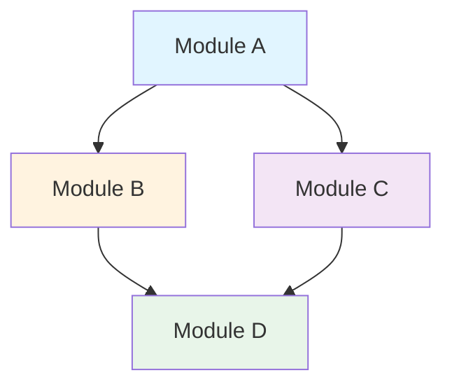

# Module Dependencies Template

<!--
This template is used by the plan-platform command to document module dependencies.
It shows the dependency graph and critical paths between modules.
-->

# Module Dependencies

> Last Updated: [CURRENT_DATE]
> Version: 1.0.0
> Platform: [PLATFORM_NAME]

## Dependency Graph

[TODO: Visual representation of module dependencies - Mermaid diagram]

## Dependency Matrix

[TODO: Detailed dependency relationships - Who depends on whom?]

| Module | Depends On | Depended By | Type | Critical Path |
|--------|------------|-------------|------|---------------|
| [Module A] | None | [Module B, C] | Foundation | Yes |
| [Module B] | [Module A] | [Module D] | Service | Yes |
| [Module C] | [Module A] | [Module D] | Service | No |
| [Module D] | [Module B, C] | None | Consumer | No |

## Dependency Details

### [Module Name] Dependencies

**Depends On:**
- **[Module Name]**
  - **Type**: [Data / Service / Infrastructure / Deployment]
  - **Direction**: [Module A] → [Module B]
  - **Coupling**: [Tight / Loose]
  - **Reason**: [Why is this dependency needed?]
  - **Interface**: [API / Events / Shared DB / Files]

**Depended By:**
- **[Module Name]**
  - **Type**: [Data / Service / Infrastructure / Deployment]
  - **Direction**: [Module B] → [Module A]
  - **Coupling**: [Tight / Loose]
  - **Reason**: [What does the dependent module consume?]
  - **Interface**: [API / Events / Shared DB / Files]

## Critical Path Analysis

[TODO: Identify critical path - Which modules must be built first?]

**Phase 1 (Foundation):**
- [Module A]: No dependencies, foundational module

**Phase 2 (Core Services):**
- [Module B]: Depends on Module A
- [Module C]: Depends on Module A

**Phase 3 (Integration):**
- [Module D]: Depends on Module B and C

## Circular Dependencies

[TODO: Identify circular dependencies - These are red flags!]

[CIRCULAR_DEPENDENCIES]

**Status**: [None / Found]

If found:
- **Modules**: [Module A] ↔ [Module B]
- **Impact**: [What breaks?]
- **Resolution**: [How to break the cycle?]

## Dependency Resolution Strategy

[TODO: How do we handle dependencies? - Build order, deployment order]

[RESOLUTION_STRATEGY]

1. **Build Order**: [Module A] → [Module B, C] → [Module D]
2. **Deployment Order**: [Same as build / Different strategy]
3. **Testing Strategy**: [Integration tests, contract tests]
4. **Versioning Strategy**: [Semantic versioning, API contracts]

---

**Note:** This dependency graph should guide the implementation roadmap. Modules with no dependencies should be built first, followed by dependent modules.
