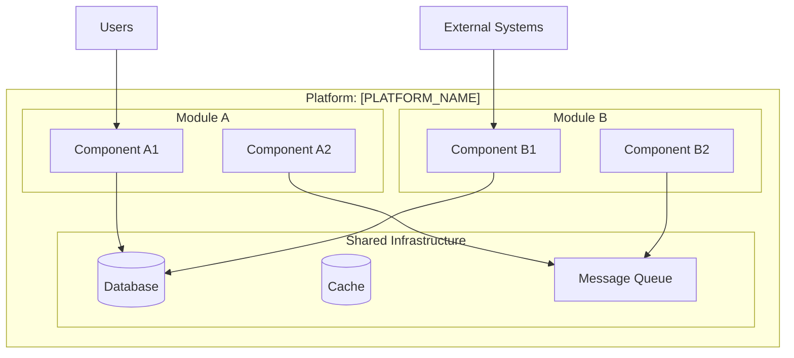
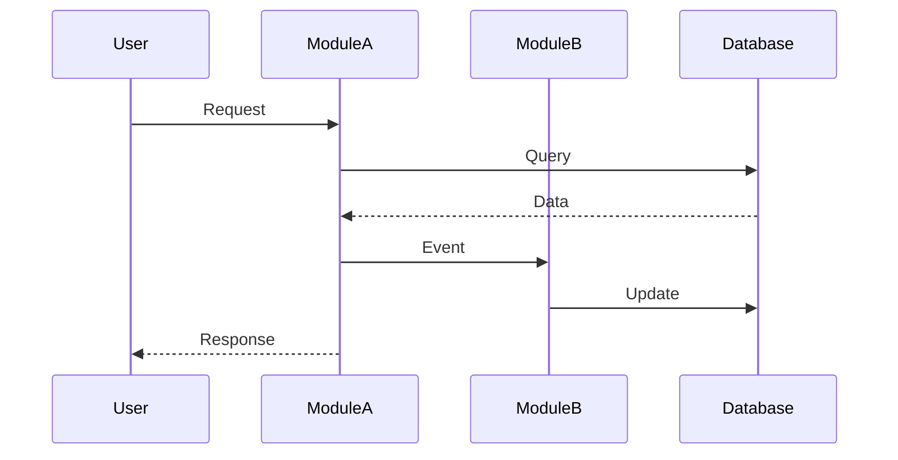
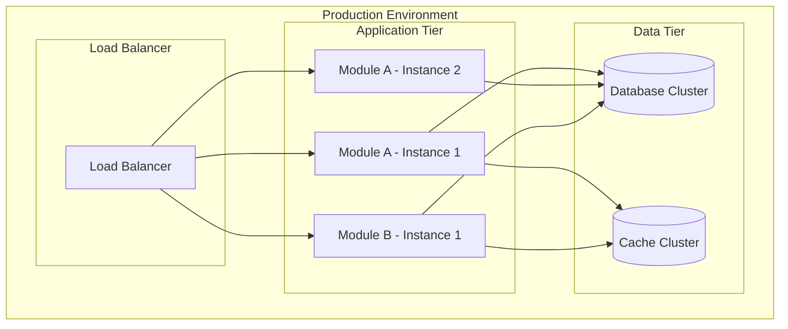

# Platform Architecture Template

<!--
This template is used by the plan-platform command to document platform architecture.
It shows system overview, data flow, integration layer, and deployment architecture.
-->

# Platform Architecture

> Last Updated: [CURRENT_DATE]
> Version: 1.0.0
> Platform: [PLATFORM_NAME]

## System Overview

[TODO: High-level architecture diagram - Show all modules and their relationships]

## Architecture Pattern

[TODO: What architecture pattern is used? - Monolith, Microservices, Modular Monolith, etc.]

**Pattern**: [ARCHITECTURE_PATTERN]

**Rationale**: [Why this pattern?]

[ARCHITECTURE_RATIONALE]

**Trade-offs**:
- **Pros**: [Benefits of this pattern]
- **Cons**: [Limitations of this pattern]

## Module Architecture

### [Module Name]

**Pattern**: [Module-specific pattern]
**Components**:
- [Component 1]: [Description]
- [Component 2]: [Description]

**Responsibilities**:
- [Responsibility 1]
- [Responsibility 2]

## Data Flow

[TODO: How does data flow through the platform? - Request/Response, Events, etc.]

**Data Flow Description**:

[DATA_FLOW_DESCRIPTION]

## Integration Layer

[TODO: How do modules integrate? - APIs, Events, Shared DB, etc.]

### Integration Patterns

**Pattern**: [Request/Response / Event-Driven / Hybrid]

**Communication**:
- **Sync**: [REST APIs / GraphQL / gRPC]
- **Async**: [Message Queue / Event Bus / Pub/Sub]

### API Gateway (if applicable)

[TODO: Is there an API Gateway? - Entry point for external requests]

[API_GATEWAY]

**Responsibilities**:
- Routing requests to modules
- Authentication/Authorization
- Rate limiting
- Request/Response transformation

### Event Bus (if applicable)

[TODO: Is there an Event Bus? - For event-driven communication]

[EVENT_BUS]

**Events**:
- **[Event Name]**: Published by [Module A], Consumed by [Module B]
- **[Event Name]**: Published by [Module B], Consumed by [Module C]

## Shared Infrastructure

[TODO: What infrastructure is shared across modules?]

### Database Strategy

**Pattern**: [Single DB / DB per Module / Hybrid]

[DATABASE_STRATEGY]

- **Shared Database**: [If applicable - What is shared?]
- **Module Databases**: [If applicable - Which modules have their own DB?]

### Caching Strategy

[CACHING_STRATEGY]

- **Cache Type**: [Redis / Memcached / In-Memory]
- **Cache Scope**: [Platform-wide / Per-module]
- **Cache Invalidation**: [Strategy]

### Message Queue (if applicable)

[MESSAGE_QUEUE]

- **Queue Technology**: [RabbitMQ / Kafka / AWS SQS]
- **Queue Purpose**: [Async processing / Event-driven / Job queue]

## Security Architecture

[TODO: How is security handled across modules?]

### Authentication & Authorization

[AUTH_STRATEGY]

- **Authentication**: [JWT / OAuth / Session-based]
- **Authorization**: [RBAC / ABAC / Custom]
- **Identity Provider**: [Built-in / External]

### Security Boundaries

[TODO: Security zones - What is public, what is internal?]

- **Public Zone**: [Modules accessible from internet]
- **Internal Zone**: [Modules only accessible internally]
- **Restricted Zone**: [Modules with elevated security]

### Data Security

[DATA_SECURITY]

- **Data at Rest**: [Encryption strategy]
- **Data in Transit**: [TLS/SSL]
- **Sensitive Data**: [PII handling, tokenization]

## Deployment Architecture

[TODO: How is the platform deployed?]

### Deployment Strategy

**Strategy**: [Monolithic Deploy / Per-Module Deploy / Hybrid]

[DEPLOYMENT_STRATEGY]

**Deployment Units**:
- **[Module A]**: [Deployment frequency, rollback strategy]
- **[Module B]**: [Deployment frequency, rollback strategy]

### Scalability

[SCALABILITY_STRATEGY]

- **Horizontal Scaling**: [Which modules scale horizontally?]
- **Vertical Scaling**: [Which modules scale vertically?]
- **Auto-scaling**: [Criteria for auto-scaling]

## Monitoring & Observability

[TODO: How is the platform monitored?]

### Logging

[LOGGING_STRATEGY]

- **Logging Framework**: [Winston / Log4j / Custom]
- **Log Aggregation**: [ELK / Splunk / CloudWatch]
- **Log Levels**: [Debug / Info / Warn / Error]

### Metrics

[METRICS_STRATEGY]

- **Metrics Collection**: [Prometheus / DataDog / Custom]
- **Key Metrics**: [Response time, Error rate, Throughput]

### Tracing

[TRACING_STRATEGY]

- **Distributed Tracing**: [Jaeger / Zipkin / X-Ray]
- **Trace Context**: [How traces propagate across modules]

## Disaster Recovery

[TODO: What happens when things go wrong?]

### Backup Strategy

[BACKUP_STRATEGY]

- **Backup Frequency**: [Daily / Weekly / Real-time]
- **Backup Retention**: [30 days / 90 days / Custom]
- **Backup Scope**: [Full / Incremental]

### Failover Strategy

[FAILOVER_STRATEGY]

- **RTO** (Recovery Time Objective): [Target downtime]
- **RPO** (Recovery Point Objective): [Acceptable data loss]
- **Failover Process**: [Automatic / Manual]

---

**Note:** This architecture should evolve as the platform grows. Review and update regularly based on performance data and changing requirements.
