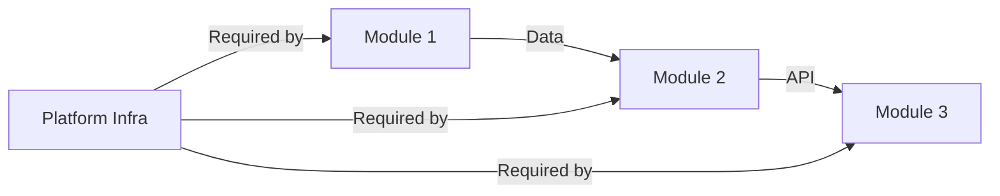

# Platform Blocker Analysis: [Platform Name]

> External dependencies and blockers across all platform modules
> Generated: [Date]
> Last Updated: [Date]

## Executive Summary

### Overall Platform Status

| Severity | Total Count | Resolved | Pending |
|----------|-------------|----------|---------|
| Critical | [X]         | [X]      | [X]     |
| High     | [X]         | [X]      | [X]     |
| Medium   | [X]         | [X]      | [X]     |
| Low      | [X]         | [X]      | [X]     |

**Platform Readiness:** [Ready to start / Blocked by X critical items / Partially blocked]

### Blockers by Module

| Module | Critical | High | Medium | Low | Status |
|--------|----------|------|--------|-----|--------|
| [Module 1] | [X] | [X] | [X] | [X] | [Ready/Blocked] |
| [Module 2] | [X] | [X] | [X] | [X] | [Ready/Blocked] |
| [Module 3] | [X] | [X] | [X] | [X] | [Ready/Blocked] |
| **Platform-Wide** | [X] | [X] | [X] | [X] | [Ready/Blocked] |

---

## Platform-Wide Blockers

Blockers that affect multiple modules or the entire platform.

### PLAT-001: [Blocker Title]

| Field | Value |
|-------|-------|
| **Category** | [Infrastructure / License / Compliance / Budget] |
| **Severity** | [Critical/High/Medium/Low] |
| **Status** | [Unknown / Requested / In Progress / Resolved] |
| **Owner** | [Owner] |
| **Needed By** | [Date/Phase] |
| **Affects Modules** | [All / Module 1, Module 2] |

**Description:**
[Description]

**Impact:**
[What cannot proceed without this]

---

## Module-Specific Blockers Overview

### [Module 1 Name]

**Module Status:** [Ready / Blocked by X items]
**Detailed Analysis:** [specwright/product/modules/[module-1]/blocker-analysis.md]

| ID | Blocker | Severity | Owner | Status |
|----|---------|----------|-------|--------|
| MOD1-001 | [Title] | Critical | [Owner] | [Status] |
| MOD1-002 | [Title] | High | [Owner] | [Status] |

---

### [Module 2 Name]

**Module Status:** [Ready / Blocked by X items]
**Detailed Analysis:** [specwright/product/modules/[module-2]/blocker-analysis.md]

| ID | Blocker | Severity | Owner | Status |
|----|---------|----------|-------|--------|
| MOD2-001 | [Title] | Critical | [Owner] | [Status] |
| MOD2-002 | [Title] | High | [Owner] | [Status] |

---

### [Module 3 Name]

**Module Status:** [Ready / Blocked by X items]
**Detailed Analysis:** [specwright/product/modules/[module-3]/blocker-analysis.md]

| ID | Blocker | Severity | Owner | Status |
|----|---------|----------|-------|--------|
| MOD3-001 | [Title] | High | [Owner] | [Status] |

---

## Cross-Module Dependencies

Blockers where one module's output is another module's input.

| Dependency | From Module | To Module | Blocker ID | Status |
|------------|-------------|-----------|------------|--------|
| [Data export] | Module 1 | Module 2 | MOD1-003 | [Status] |
| [API access] | Module 2 | Module 3 | MOD2-005 | [Status] |

---

## Timeline View (Across All Modules)

### Phase 1: Foundation

| Module | Blockers to Resolve | Count | Critical |
|--------|---------------------|-------|----------|
| Platform-Wide | PLAT-001, PLAT-002 | 2 | Yes |
| [Module 1] | MOD1-001 | 1 | Yes |

### Phase 2: Core Features

| Module | Blockers to Resolve | Count | Critical |
|--------|---------------------|-------|----------|
| [Module 2] | MOD2-001, MOD2-002 | 2 | No |
| [Module 3] | MOD3-001 | 1 | No |

### Phase 3: Enhancement

| Module | Blockers to Resolve | Count | Critical |
|--------|---------------------|-------|----------|
| [Module 1] | MOD1-003 | 1 | No |

---

## Critical Path Analysis

### Must Resolve Before ANY Development

| ID | Blocker | Module | Owner | Action Needed |
|----|---------|--------|-------|---------------|
| PLAT-001 | [Title] | Platform-Wide | [Owner] | [Action] |
| MOD1-001 | [Title] | Module 1 | [Owner] | [Action] |

### Longest Lead-Time Items

| ID | Blocker | Module | Lead Time | Start By |
|----|---------|--------|-----------|----------|
| PLAT-002 | [Title] | Platform-Wide | [X weeks] | [Date] |
| MOD2-003 | [Title] | Module 2 | [X weeks] | [Date] |

---

## Action Items Summary

### Immediate (This Week)

| Priority | Action | Module | Owner | Due |
|----------|--------|--------|-------|-----|
| 1 | [Action] | Platform | [Owner] | [Date] |
| 2 | [Action] | Module 1 | [Owner] | [Date] |
| 3 | [Action] | Module 2 | [Owner] | [Date] |

### Before Phase 1 Start

| Priority | Action | Module | Owner | Due |
|----------|--------|--------|-------|-----|
| 1 | [Action] | Platform | [Owner] | [Date] |
| 2 | [Action] | Module 1 | [Owner] | [Date] |

### Before Phase 2 Start

| Priority | Action | Module | Owner | Due |
|----------|--------|--------|-------|-----|
| 1 | [Action] | Module 2 | [Owner] | [Date] |
| 2 | [Action] | Module 3 | [Owner] | [Date] |

---

## Stakeholder Communication Matrix

| Stakeholder | Modules Affected | Blocker IDs | Primary Contact |
|-------------|------------------|-------------|-----------------|
| [IT Team] | Platform, Module 1 | PLAT-001, MOD1-002 | [Name] |
| [Legal] | Platform | PLAT-003 | [Name] |
| [External Vendor] | Module 2 | MOD2-001 | [Name] |

---

## Detailed Module Analyses

Full blocker details for each module are available in:

| Module | File Location |
|--------|---------------|
| [Module 1] | `specwright/product/modules/[module-1]/blocker-analysis.md` |
| [Module 2] | `specwright/product/modules/[module-2]/blocker-analysis.md` |
| [Module 3] | `specwright/product/modules/[module-3]/blocker-analysis.md` |

---

## Revision History

| Date | Changes | Updated By |
|------|---------|------------|
| [Date] | Initial platform analysis | [Agent/User] |
