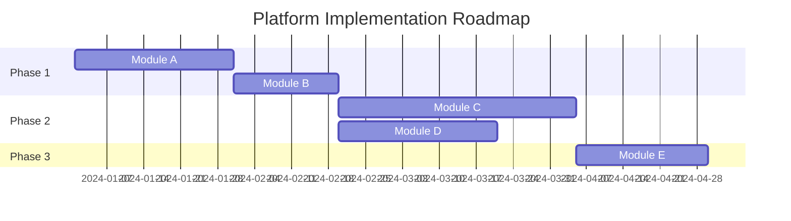

# Platform Roadmap Template

<!--
This template is used by the plan-platform command to generate a platform roadmap.
It shows implementation phases with module groups based on dependencies and priorities.
-->

# Platform Roadmap

> Last Updated: [CURRENT_DATE]
> Version: 1.0.0
> Platform: [PLATFORM_NAME]

## Overview

[TODO: High-level roadmap overview - What are the main phases?]

[ROADMAP_OVERVIEW]

**Total Modules**: [N]
**Total Phases**: [M]
**Target Timeline**: [If applicable - avoid hard dates]

## Roadmap Visualization

## Phase 1: Foundation

**Goal**: [What is the goal of this phase?]

[PHASE_1_GOAL]

**Modules in this Phase**:

### [Module Name]
- **Priority**: Must Have
- **Effort**: [XS / S / M / L / XL]
- **Dependencies**: None (foundational)
- **Deliverables**:
  - [Deliverable 1]
  - [Deliverable 2]
- **Success Criteria**:
  - [Criterion 1]
  - [Criterion 2]

### [Module Name]
- **Priority**: Must Have
- **Effort**: [XS / S / M / L / XL]
- **Dependencies**: None
- **Deliverables**:
  - [Deliverable 1]
- **Success Criteria**:
  - [Criterion 1]

**Phase 1 Milestones**:
- [ ] [Milestone 1]: [Description]
- [ ] [Milestone 2]: [Description]
- [ ] Phase 1 Complete: All foundational modules operational

---

## Phase 2: Core Features

**Goal**: [What is the goal of this phase?]

[PHASE_2_GOAL]

**Modules in this Phase**:

### [Module Name]
- **Priority**: Must Have / Should Have
- **Effort**: [XS / S / M / L / XL]
- **Dependencies**: [Module A from Phase 1]
- **Deliverables**:
  - [Deliverable 1]
  - [Deliverable 2]
- **Success Criteria**:
  - [Criterion 1]
  - [Criterion 2]

**Phase 2 Milestones**:
- [ ] [Milestone 1]: [Description]
- [ ] [Milestone 2]: [Description]
- [ ] Phase 2 Complete: Core value-generating features live

---

## Phase 3: Enhancement

**Goal**: [What is the goal of this phase?]

[PHASE_3_GOAL]

**Modules in this Phase**:

### [Module Name]
- **Priority**: Should Have / Could Have
- **Effort**: [XS / S / M / L / XL]
- **Dependencies**: [Modules from Phase 1, 2]
- **Deliverables**:
  - [Deliverable 1]
- **Success Criteria**:
  - [Criterion 1]

**Phase 3 Milestones**:
- [ ] [Milestone 1]: [Description]
- [ ] Phase 3 Complete: Enhanced platform with additional capabilities

---

## Phase 4: Optimization

**Goal**: [What is the goal of this phase?]

[PHASE_4_GOAL]

**Focus Areas**:
- Performance optimization
- Monitoring and observability
- Advanced features
- User experience improvements

**Modules in this Phase**:

### [Module Name]
- **Priority**: Could Have / Nice to Have
- **Effort**: [XS / S / M / L / XL]
- **Dependencies**: [Previous modules]
- **Deliverables**:
  - [Deliverable 1]
- **Success Criteria**:
  - [Criterion 1]

**Phase 4 Milestones**:
- [ ] [Milestone 1]: [Description]
- [ ] Phase 4 Complete: Optimized platform ready for scale

---

## Priority Legend

- **Must Have**: Critical for platform to function
- **Should Have**: Important but platform can launch without
- **Could Have**: Nice to have, adds value
- **Won't Have (this phase)**: Deferred to future phases

## Effort Estimates

- **XS**: 1-3 days
- **S**: 4-7 days
- **M**: 8-15 days
- **L**: 16-30 days
- **XL**: 30+ days

**Note**: Estimates are rough and may change based on actual implementation complexity.

## Dependency Chain

[TODO: Show critical path - Which modules block others?]

**Critical Path**:
1. [Module A] (Phase 1) → Blocks [Module B, C]
2. [Module B] (Phase 2) → Blocks [Module D]
3. [Module D] (Phase 3) → Blocks [Module E]

**Parallel Tracks**:
- Track 1: [Module A] → [Module B] → [Module D]
- Track 2: [Module A] → [Module C] → [Module E]

## Risk Mitigation

[TODO: What are the risks and how to mitigate?]

| Risk | Impact | Likelihood | Mitigation |
|------|--------|-----------|------------|
| [Module A] delays Phase 2 | High | Medium | Start [Module A] early, add buffer |
| [Integration complexity] | Medium | High | Prototype integration early |
| [Resource availability] | High | Low | Cross-train team members |

---

**Note:** This roadmap should be reviewed and updated regularly based on actual progress and changing priorities. Phases may overlap or shift based on learnings.
