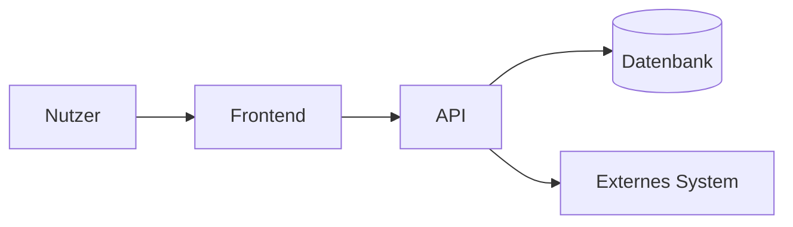

# Architektur: [Produkt] — Soll

> **Stand:** JJJJ-MM-TT, Commit [sha] · **Verantwortlich:** [Tech Lead]
> **Rolle dieses Dokuments:** das SOLL. Pflichtinput im Plan Mode. Das Drift-Skript vergleicht das Ist dagegen. Verschiebt ein Plan eine Grenze, ändert dieselbe PR dieses Dokument.
> **Prinzipien der Firma:** [Pfad im Firmen-Repo] — dieses Dokument darf sie konkretisieren, nicht verletzen.

<!-- Ebene: Services/Container (C4-Ebene 2). Keine Klassen, keine Funktionen.
     Unter 3 Seiten. Was länger wird, gehört in ein ADR oder in den Code.
     Jede Regel hat eine ID (AR-nn), damit Drift-Skript, Review und Plan darauf verweisen können. -->

## 1. Überblick

[3 Sätze: Was das System ist, wie Anfragen laufen, wo die Daten liegen.]

## 2. Services und Komponenten

<!-- Ein Satz Verantwortung. Wer zwei Sätze braucht, hat zwei Services. -->

| Name | Verantwortung (ein Satz) | Technologie | Pfad / Repo | Owner |
|---|---|---|---|---|
| [Frontend] | […] | […] | `app/` | […] |
| [API] | […] | […] | `api/` | […] |

## 3. Datenbesitz

<!-- Jedes fachliche Datenobjekt hat genau einen besitzenden Service. Andere lesen über dessen Schnittstelle, nie direkt. Bei Mandanten: wie getrennt. -->

| Datenobjekt | Besitzer | Speicher | Andere lesen über | Mandantentrennung |
|---|---|---|---|---|
| [Profil] | [Service] | [Firestore `profiles`] | [API `GET /profiles`] | [Feld `tenantId`, Regel AR-03] |

## 4. Erlaubte Abhängigkeiten

<!-- Regeln, die das Drift-Skript prüft. Quelle des Ist: Compose / Manifeste / Imports / Traces (Abschnitt 9). -->

| ID | Regel | Grund | Prüfung |
|---|---|---|---|
| AR-01 | `[Frontend]` ruft nur `[API]`, nie Speicher direkt. | […] | Import-Scan / Traces |
| AR-02 | `[Service A]` darf `[Service B]` aufrufen; umgekehrt verboten. | Zyklus | Traces |
| AR-03 | Jede Abfrage auf `[Speicher]` filtert nach Mandant. | Datenschutz | Regel-Datei / Test |

**Verboten, ausdrücklich:** [z. B. gemeinsame Datenbank zwischen Services; Secrets im Image; direkte Aufrufe an Drittsysteme aus dem Frontend]

## 5. Externe Systeme

| System | Wofür | Aufruf aus | Ausfall bedeutet | Zugang liegt in |
|---|---|---|---|---|
| […] | […] | [Service] | […] | [security.md §3] |

## 6. Tech-Stack

<!-- Nur was für Entscheidungen zählt: Sprache, Framework, Laufzeit, Speicher, Hosting, jeweils mit Version und Pinning-Regel. -->

| Schicht | Technologie | Version | Pinning |
|---|---|---|---|
| Sprache | […] | […] | [exakt / caret] |
| Framework | […] | […] | […] |
| Speicher | […] | […] | […] |
| Hosting | […] | […] | […] |

## 7. Projektspezifische Prinzipien

<!-- 3 bis 7. Was hier anders ist als in den Firmenprinzipien, mit Grund. -->

- **AP-01:** […] — Grund: […]

## 8. Entscheidungen

- ADR-Ordner: `docs/decisions/` (Nummer, Titel, Status). Index dort, nicht hier.
- Letzte Entscheidungen, die dieses Soll geprägt haben: [ADR-nnnn], [ADR-nnnn]

## 9. Drift-Erkennung

- **Skript:** `[tools/architecture-drift.sh]` — läuft in CI bei jedem PR und nachts.
- **Quelle des Ist:** [docker-compose.yml / Kubernetes-Manifeste / Import-Graph / OpenTelemetry-Service-Graph]
- **Geprüfte Regeln:** AR-01 … AR-nn
- **Bei Verstoß:** PR rot, Befund als `intent.md` in `intent/` (Format Phase 1), Triage durch [Rolle]. Agent wird erst danach eingeschaltet.

## 10. Bekannte Abweichungen (Ist ≠ Soll)

<!-- Ehrliche Liste. Jede mit Board-Karte oder intent.md. Ohne Karte darf hier nichts stehen. -->

| Abweichung | Regel | Seit | Karte / Intent | Plan |
|---|---|---|---|---|
| […] | AR-nn | JJJJ-MM | […] | […] |

## Änderungsprotokoll

| Datum | Änderung | PR / ADR |
|---|---|---|
| JJJJ-MM-TT | Erstfassung | — |
