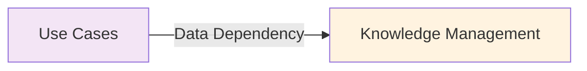
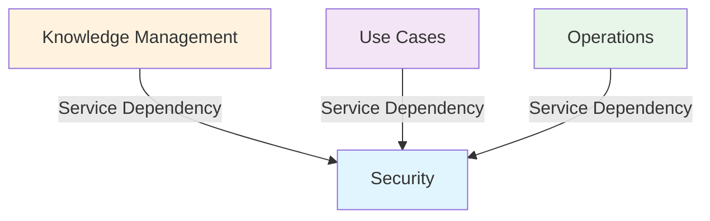
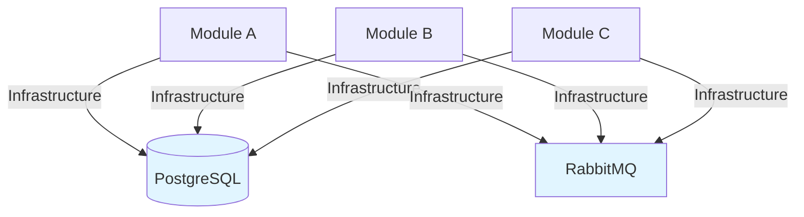
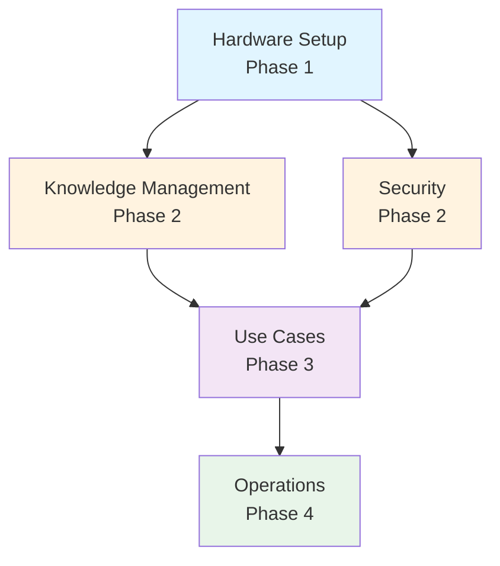
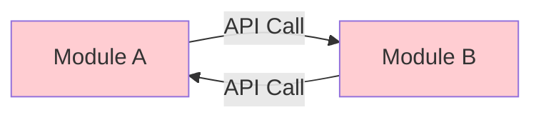
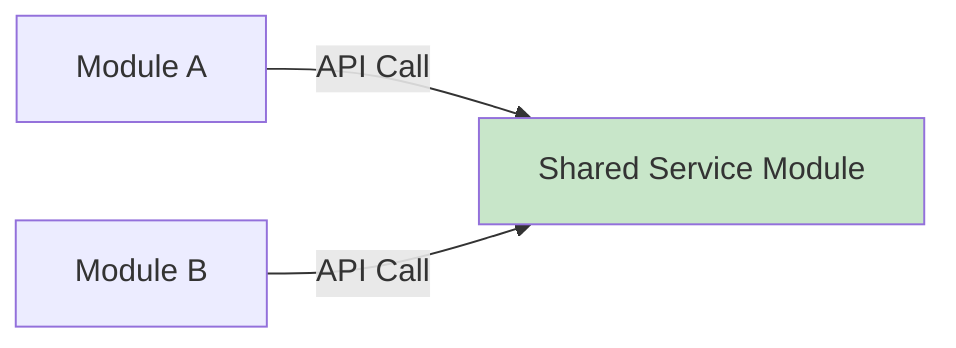
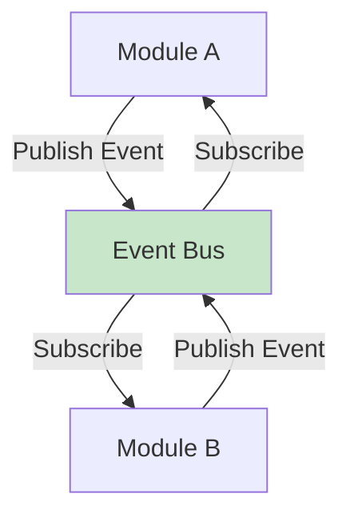
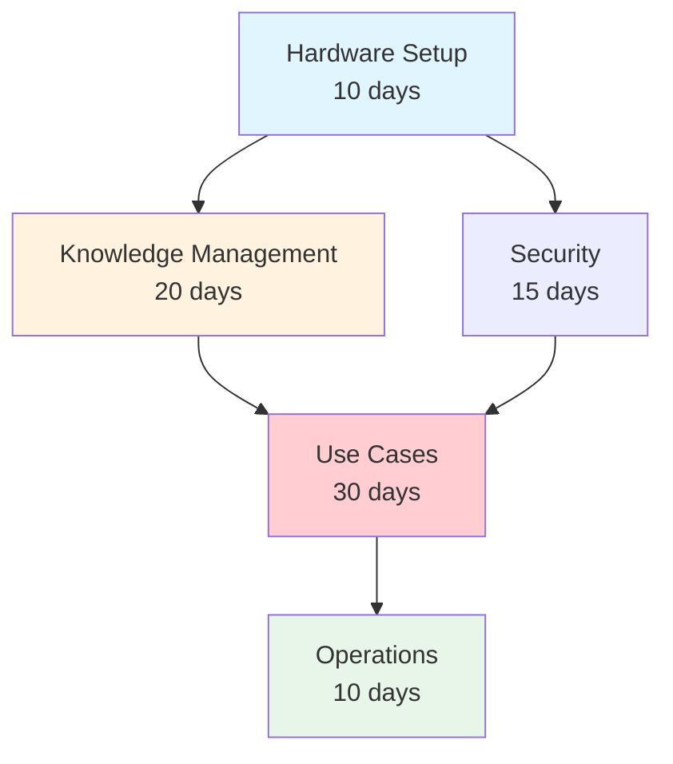
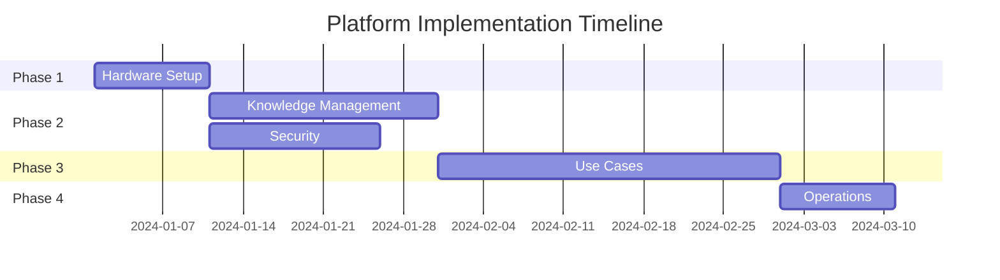

# [SKILL_NAME] - Dependency Management

> **Role:** Platform Dependency Analyst
> **Domain:** Module Dependencies & Build Order
> **Created:** [CURRENT_DATE]

## Purpose

Analyze, document, and manage dependencies between modules in multi-module platforms. Identify critical paths, prevent circular dependencies, and structure implementation phases based on dependency graphs.

## When to Activate

**Use this skill for:**
- Analyzing module dependencies
- Creating dependency graphs
- Identifying circular dependencies
- Determining build/deployment order
- Planning phased rollouts
- Managing module versioning

**Do NOT use for:**
- Package manager dependencies (npm, pip, etc.)
- Single-module internal dependencies
- Database foreign key relationships

## Core Capabilities

### 1. Dependency Analysis
- Data dependencies (Module A needs Module B data)
- Service dependencies (Module A calls Module B APIs)
- Infrastructure dependencies (shared resources)
- Deployment dependencies (Module A before Module B)

### 2. Dependency Graph Construction
- Visual representation (Mermaid diagrams)
- Dependency matrix documentation
- Critical path identification
- Parallel track analysis

### 3. Circular Dependency Detection
- Identify circular references
- Recommend resolution strategies
- Propose intermediary modules

### 4. Phased Roadmap Structuring
- Group modules by dependency layers
- Identify foundational modules
- Plan parallel development tracks
- Minimize blocking dependencies

## Dependency Types

### Type 1: Data Dependency

**Definition:** Module A needs data produced/stored by Module B

**Example:**
```
Knowledge Management (Module B) stores parsed documents
↓
Use Cases (Module A) queries Knowledge Management for document data
```

**Analysis:**
- Direction: Use Cases → Knowledge Management
- Type: Read-only data dependency
- Coupling: Medium (depends on data schema)
- Criticality: High (Use Cases cannot function without Knowledge Management)

**Implementation Pattern:**
```typescript
// Module A (Use Cases) - Consumer
class DocumentAnalyzer {
  constructor(private knowledgeAPI: KnowledgeManagementAPI) {}

  async analyzeDocument(documentId: string) {
    // Data dependency: fetch from Knowledge Management
    const document = await this.knowledgeAPI.getDocument(documentId);

    if (!document) {
      throw new Error('Document not found in Knowledge Management');
    }

    // Analyze document...
    return this.performAnalysis(document);
  }
}

// Module B (Knowledge Management) - Provider
interface Document {
  id: string;
  content: string;
  metadata: Record<string, any>;
  indexed: Date;
}

class KnowledgeManagementAPI {
  async getDocument(id: string): Promise<Document | null> {
    return this.repository.findById(id);
  }
}
```

**Dependency Graph:**


---

### Type 2: Service Dependency

**Definition:** Module A invokes Module B services/APIs

**Example:**
```
Security (Module B) provides authentication service
↓
All modules (Module A, C, D) call Security for auth checks
```

**Analysis:**
- Direction: All Modules → Security
- Type: Service call (synchronous)
- Coupling: Tight (all modules depend on Security availability)
- Criticality: Blocking (all modules cannot start without Security)

**Implementation Pattern:**
```typescript
// Module B (Security) - Service Provider
class SecurityService {
  async authenticateUser(token: string): Promise<User | null> {
    const decoded = await this.jwtService.verify(token);
    return this.userRepository.findById(decoded.userId);
  }

  async checkPermission(userId: string, resource: string, action: string): Promise<boolean> {
    const permissions = await this.permissionRepository.findByUser(userId);
    return permissions.some(p => p.resource === resource && p.action === action);
  }
}

// Module A, C, D - Service Consumers
class UseCase {
  constructor(private securityService: SecurityService) {}

  async execute(token: string, params: any) {
    // Service dependency: call Security module
    const user = await this.securityService.authenticateUser(token);

    if (!user) {
      throw new UnauthorizedError();
    }

    const hasPermission = await this.securityService.checkPermission(
      user.id,
      'documents',
      'read'
    );

    if (!hasPermission) {
      throw new ForbiddenError();
    }

    // Execute use case...
  }
}
```

**Dependency Graph:**


---

### Type 3: Infrastructure Dependency

**Definition:** Modules share infrastructure resources (database, cache, queue)

**Example:**
```
All modules share PostgreSQL database
All modules publish to same RabbitMQ exchange
```

**Analysis:**
- Direction: All Modules → Shared Infrastructure
- Type: Resource sharing
- Coupling: Infrastructure-level
- Criticality: Blocking (modules cannot function without infrastructure)

**Implementation Pattern:**
```typescript
// Shared Infrastructure Configuration
interface InfrastructureConfig {
  database: {
    host: string;
    port: number;
    database: string;
  };
  messageQueue: {
    host: string;
    exchange: string;
  };
  cache: {
    host: string;
    ttl: number;
  };
}

// Module A uses shared database
class ModuleARepository {
  constructor(private sharedDB: DatabaseConnection) {}

  async save(entity: Entity) {
    return this.sharedDB.query('INSERT INTO module_a_entities...', [entity]);
  }
}

// Module B uses shared database
class ModuleBRepository {
  constructor(private sharedDB: DatabaseConnection) {}

  async save(entity: Entity) {
    return this.sharedDB.query('INSERT INTO module_b_entities...', [entity]);
  }
}
```

**Dependency Graph:**


---

### Type 4: Deployment Dependency

**Definition:** Module A must be deployed before Module B

**Example:**
```
Hardware Setup (Module A) must be deployed before Knowledge Management (Module B)
Knowledge Management must be deployed before Use Cases
```

**Analysis:**
- Direction: Hardware → Knowledge Mgmt → Use Cases
- Type: Sequential deployment
- Coupling: Deployment-time
- Criticality: Blocking (later modules cannot deploy until earlier ones are ready)

**Deployment Order:**
```yaml
# deployment-order.yml
phases:
  - phase: 1
    name: Foundation
    modules:
      - hardware-setup
    deploy_strategy: sequential

  - phase: 2
    name: Core Services
    modules:
      - knowledge-management
      - security
    deploy_strategy: parallel  # Can deploy in parallel

  - phase: 3
    name: Features
    modules:
      - use-cases
    deploy_strategy: sequential
    depends_on: [knowledge-management, security]

  - phase: 4
    name: Operations
    modules:
      - operations
    deploy_strategy: sequential
    depends_on: [use-cases]
```

**Dependency Graph:**


## Circular Dependency Detection

### Example: Circular Dependency

**Problem:**
```
Module A depends on Module B (calls API)
Module B depends on Module A (calls API)
```

**Dependency Graph:**


**Detection Algorithm:**
```typescript
class CircularDependencyDetector {
  detect(modules: Module[]): CircularDependency[] {
    const visited = new Set<string>();
    const recursionStack = new Set<string>();
    const cycles: CircularDependency[] = [];

    for (const module of modules) {
      if (!visited.has(module.id)) {
        this.dfs(module, visited, recursionStack, [], cycles);
      }
    }

    return cycles;
  }

  private dfs(
    module: Module,
    visited: Set<string>,
    recursionStack: Set<string>,
    path: string[],
    cycles: CircularDependency[]
  ) {
    visited.add(module.id);
    recursionStack.add(module.id);
    path.push(module.id);

    for (const dependency of module.dependencies) {
      if (!visited.has(dependency.id)) {
        this.dfs(dependency, visited, recursionStack, path, cycles);
      } else if (recursionStack.has(dependency.id)) {
        // Circular dependency detected!
        const cycleStart = path.indexOf(dependency.id);
        const cycle = path.slice(cycleStart).concat(dependency.id);

        cycles.push({
          modules: cycle,
          severity: 'HIGH',
          impact: 'Blocks deployment and development'
        });
      }
    }

    recursionStack.delete(module.id);
    path.pop();
  }
}
```

### Resolution Strategies

**Strategy 1: Introduce Intermediary Module**


**Strategy 2: Use Event-Driven Pattern**


**Strategy 3: Merge Modules**
If circular dependency cannot be broken, modules might be too tightly coupled and should be merged.

## Critical Path Analysis

### Definition
**Critical Path**: Sequence of dependent modules that determines the minimum time to complete platform.

### Example Analysis

**Modules:**
1. Hardware Setup (10 days)
2. Knowledge Management (20 days, depends on Hardware)
3. Security (15 days, depends on Hardware)
4. Use Cases (30 days, depends on Knowledge Management + Security)
5. Operations (10 days, depends on Use Cases)

**Dependency Graph with Effort:**


**Critical Path Calculation:**
```
Path 1: Hardware → Knowledge Management → Use Cases → Operations
Total: 10 + 20 + 30 + 10 = 70 days (CRITICAL PATH)

Path 2: Hardware → Security → Use Cases → Operations
Total: 10 + 15 + 30 + 10 = 65 days

Critical Path: Path 1 (70 days)
Bottleneck Module: Use Cases (30 days)
```

**Optimization Opportunities:**
- Knowledge Management and Security can be developed in parallel (saves 5 days)
- Focus on reducing Use Cases complexity (bottleneck)

### Parallel Tracks

**Track A:**
```
Hardware Setup → Knowledge Management → Use Cases → Operations
Timeline: Day 0-10 → Day 10-30 → Day 30-60 → Day 60-70
```

**Track B (Parallel):**
```
Hardware Setup → Security ----→ (waits for Knowledge Management) → Use Cases
Timeline: Day 0-10 → Day 10-25 → (wait until Day 30) → Day 30-60
```

**Gantt Chart:**


## Dependency Matrix

**Format:**
| Module | Depends On | Depended By | Type | Critical Path |
|--------|------------|-------------|------|---------------|
| Hardware | - | Knowledge, Security | Foundation | Yes |
| Knowledge | Hardware | Use Cases | Data/Service | Yes |
| Security | Hardware | Use Cases | Service | No |
| Use Cases | Knowledge, Security | Operations | Service | Yes |
| Operations | Use Cases | - | Consumer | Yes |

## Tools Required

### Visualization
- Mermaid.js (dependency graphs)
- Graphviz (complex graphs)
- Draw.io (manual diagrams)

### Analysis
- Custom scripts (detect circular deps)
- Build tools (module graphs)

### Documentation
- Markdown tables (dependency matrix)
- YAML/JSON (dependency config)

## Quality Checklist

### Before Analysis
- [ ] All modules identified
- [ ] Module boundaries clear
- [ ] Dependency types understood

### During Analysis
- [ ] All dependencies documented
- [ ] Dependency types classified
- [ ] Circular dependencies checked
- [ ] Critical path identified

### After Analysis
- [ ] Dependency graph visualized
- [ ] Dependency matrix created
- [ ] Resolution strategies documented
- [ ] Phased roadmap aligned with dependencies

## Common Patterns

### Layered Dependencies
```
Layer 1 (Foundation): No dependencies
Layer 2 (Services): Depends on Layer 1
Layer 3 (Features): Depends on Layer 2
Layer 4 (Presentation): Depends on Layer 3
```

### Star Pattern
```
Central module (shared service)
All other modules depend on central module
No dependencies between outer modules
```

### Pipeline Pattern
```
Module A → Module B → Module C → Module D
Sequential processing pipeline
Each module depends only on previous
```

## Anti-Patterns to Avoid

- **Circular Dependencies**: Module A ↔ Module B
- **God Module**: One module everyone depends on
- **Deep Dependency Chains**: A → B → C → D → E → F
- **Hidden Dependencies**: Undocumented module coupling
- **Tight Coupling**: Direct code references instead of interfaces

## Performance Considerations

- Minimize cross-module API calls
- Cache frequently accessed dependencies
- Use async communication for non-critical dependencies
- Batch requests when possible

---

**Remember:** Dependencies should be explicit, documented, and minimized. Aim for loose coupling and high cohesion. Critical path determines platform delivery timeline.
