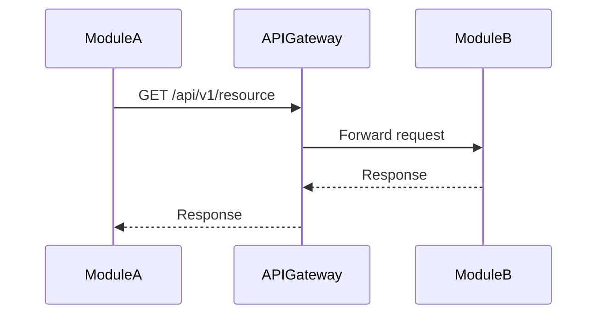
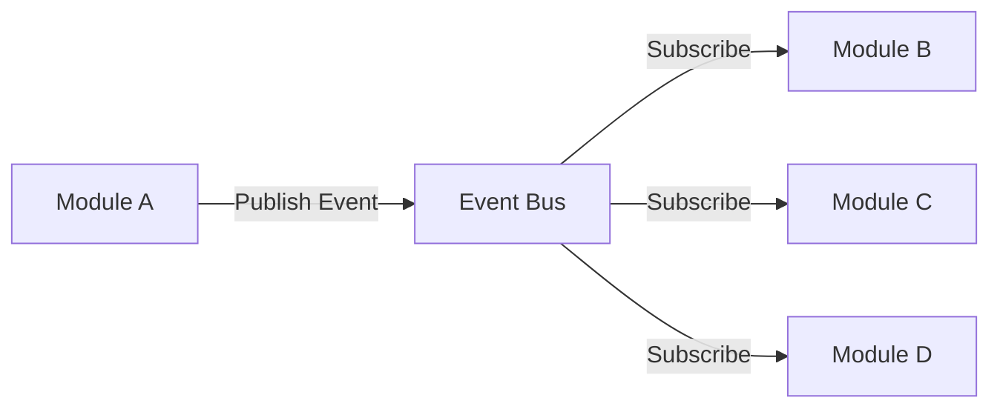
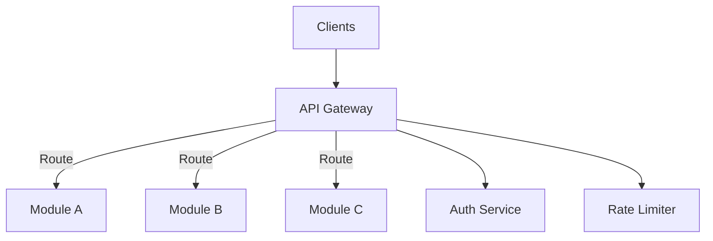
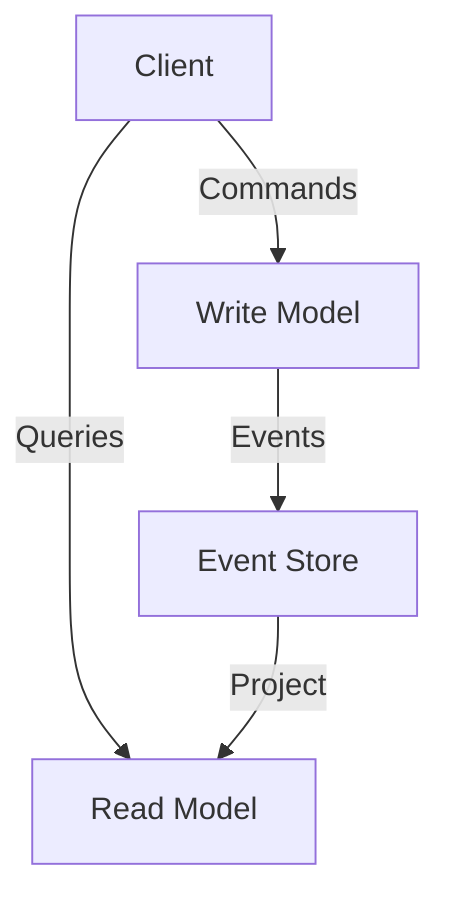

# [SKILL_NAME] - System Integration Patterns

> **Role:** Platform Integration Architect
> **Domain:** Multi-Module Communication & Integration
> **Created:** [CURRENT_DATE]

## Purpose

Design and implement integration patterns for multi-module platforms. Focus on how modules communicate, share data, and maintain loose coupling while ensuring reliability and performance.

## When to Activate

**Use this skill for:**
- Designing module-to-module communication
- Choosing integration patterns (REST, Events, RPC, etc.)
- Implementing API contracts between modules
- Event-driven architecture design
- Service mesh and API gateway setup
- Data synchronization strategies

**Do NOT use for:**
- Single-module internal architecture
- Database schema design (use persistence patterns)
- UI component integration (use frontend skills)

## Core Capabilities

### 1. Integration Pattern Selection
- Request/Response (REST, GraphQL, gRPC)
- Event-Driven (Pub/Sub, Event Sourcing)
- Hybrid approaches (CQRS)
- Batch/ETL integration

### 2. API Contract Design
- Interface definition
- Versioning strategy
- Backward compatibility
- Contract testing

### 3. Event Architecture
- Event schema design
- Event routing and filtering
- Event ordering guarantees
- Event replay and recovery

### 4. Integration Middleware
- API Gateway patterns
- Service mesh configuration
- Message broker setup
- Load balancing strategies

## Integration Patterns

### Pattern 1: Synchronous REST API

**When to Use:**
- Request requires immediate response
- Simple CRUD operations
- Direct module-to-module calls
- User-facing operations

**Architecture:**


**Implementation Example (Node.js/Express):**
```typescript
// Module B - API Provider
import express from 'express';

interface ResourceResponse {
  id: string;
  data: any;
  version: string;
}

// API Contract
class ResourceAPI {
  private router = express.Router();

  constructor(private resourceService: ResourceService) {
    this.setupRoutes();
  }

  private setupRoutes() {
    // Versioned endpoint
    this.router.get('/v1/resources/:id', async (req, res) => {
      try {
        const resource = await this.resourceService.findById(req.params.id);

        if (!resource) {
          return res.status(404).json({
            error: 'Resource not found',
            version: 'v1'
          });
        }

        const response: ResourceResponse = {
          id: resource.id,
          data: resource.data,
          version: 'v1'
        };

        res.json(response);
      } catch (error) {
        res.status(500).json({
          error: 'Internal server error',
          message: error.message
        });
      }
    });
  }

  getRouter() {
    return this.router;
  }
}

// Module A - API Consumer
class ResourceClient {
  constructor(private baseUrl: string) {}

  async getResource(id: string): Promise<ResourceResponse> {
    const response = await fetch(`${this.baseUrl}/v1/resources/${id}`);

    if (!response.ok) {
      throw new Error(`Failed to fetch resource: ${response.statusText}`);
    }

    return response.json();
  }
}
```

**Trade-offs:**
- ✅ Simple, familiar pattern
- ✅ Immediate response
- ✅ Easy debugging
- ❌ Tight coupling (modules must be available)
- ❌ Cascading failures
- ❌ Scalability bottlenecks

---

### Pattern 2: Event-Driven (Pub/Sub)

**When to Use:**
- Asynchronous workflows
- Multiple consumers for same event
- Decoupling modules
- Audit trails and logging

**Architecture:**


**Implementation Example (RabbitMQ):**
```typescript
// Event Schema
interface DomainEvent {
  eventId: string;
  eventType: string;
  occurredAt: Date;
  payload: any;
  version: number;
}

interface OrderCreatedEvent extends DomainEvent {
  eventType: 'OrderCreated';
  payload: {
    orderId: string;
    userId: string;
    items: Array<{ productId: string; quantity: number }>;
    totalAmount: number;
  };
}

// Module A - Event Publisher
import amqp from 'amqplib';

class EventPublisher {
  private connection: amqp.Connection;
  private channel: amqp.Channel;

  async connect() {
    this.connection = await amqp.connect('amqp://localhost');
    this.channel = await this.connection.createChannel();
  }

  async publishEvent(event: DomainEvent) {
    const exchange = 'platform.events';

    await this.channel.assertExchange(exchange, 'topic', { durable: true });

    this.channel.publish(
      exchange,
      event.eventType,
      Buffer.from(JSON.stringify(event)),
      { persistent: true }
    );

    console.log(`Published event: ${event.eventType}`);
  }
}

// Module B, C, D - Event Subscribers
class OrderEventSubscriber {
  private connection: amqp.Connection;
  private channel: amqp.Channel;

  async connect() {
    this.connection = await amqp.connect('amqp://localhost');
    this.channel = await this.connection.createChannel();
  }

  async subscribe(handler: (event: OrderCreatedEvent) => Promise<void>) {
    const exchange = 'platform.events';
    const queue = 'module-b.order-events';

    await this.channel.assertExchange(exchange, 'topic', { durable: true });
    await this.channel.assertQueue(queue, { durable: true });
    await this.channel.bindQueue(queue, exchange, 'OrderCreated');

    this.channel.consume(queue, async (msg) => {
      if (msg) {
        const event = JSON.parse(msg.content.toString()) as OrderCreatedEvent;

        try {
          await handler(event);
          this.channel.ack(msg);
        } catch (error) {
          console.error('Failed to process event:', error);
          // Requeue or dead-letter
          this.channel.nack(msg, false, false);
        }
      }
    });
  }
}

// Usage
const publisher = new EventPublisher();
await publisher.connect();

const event: OrderCreatedEvent = {
  eventId: crypto.randomUUID(),
  eventType: 'OrderCreated',
  occurredAt: new Date(),
  version: 1,
  payload: {
    orderId: '123',
    userId: 'user-456',
    items: [{ productId: 'prod-789', quantity: 2 }],
    totalAmount: 99.99
  }
};

await publisher.publishEvent(event);
```

**Trade-offs:**
- ✅ Loose coupling
- ✅ Multiple consumers
- ✅ Resilient (queue buffers)
- ❌ Eventual consistency
- ❌ Complex debugging
- ❌ Event ordering challenges

---

### Pattern 3: API Gateway

**When to Use:**
- Single entry point for platform
- Authentication/Authorization centralization
- Rate limiting and throttling
- Request routing to modules

**Architecture:**


**Implementation Example (Kong/Express):**
```typescript
// API Gateway
import express from 'express';
import httpProxy from 'http-proxy-middleware';

class APIGateway {
  private app = express();

  constructor(
    private authService: AuthService,
    private rateLimiter: RateLimiter
  ) {
    this.setupMiddleware();
    this.setupRoutes();
  }

  private setupMiddleware() {
    // Authentication
    this.app.use(async (req, res, next) => {
      const token = req.headers.authorization?.replace('Bearer ', '');

      if (!token) {
        return res.status(401).json({ error: 'Unauthorized' });
      }

      try {
        const user = await this.authService.verifyToken(token);
        req.user = user;
        next();
      } catch (error) {
        res.status(401).json({ error: 'Invalid token' });
      }
    });

    // Rate Limiting
    this.app.use(async (req, res, next) => {
      const userId = req.user?.id;
      const allowed = await this.rateLimiter.checkLimit(userId);

      if (!allowed) {
        return res.status(429).json({ error: 'Too many requests' });
      }

      next();
    });
  }

  private setupRoutes() {
    // Route to Module A
    this.app.use('/api/users', httpProxy.createProxyMiddleware({
      target: 'http://module-a:3001',
      changeOrigin: true,
      pathRewrite: { '^/api/users': '/v1/users' }
    }));

    // Route to Module B
    this.app.use('/api/orders', httpProxy.createProxyMiddleware({
      target: 'http://module-b:3002',
      changeOrigin: true,
      pathRewrite: { '^/api/orders': '/v1/orders' }
    }));

    // Route to Module C
    this.app.use('/api/products', httpProxy.createProxyMiddleware({
      target: 'http://module-c:3003',
      changeOrigin: true,
      pathRewrite: { '^/api/products': '/v1/products' }
    }));
  }

  listen(port: number) {
    this.app.listen(port, () => {
      console.log(`API Gateway listening on port ${port}`);
    });
  }
}
```

**Trade-offs:**
- ✅ Single entry point
- ✅ Centralized auth/rate limiting
- ✅ Request routing logic
- ❌ Single point of failure
- ❌ Added latency
- ❌ Gateway becomes bottleneck

---

### Pattern 4: CQRS (Command Query Responsibility Segregation)

**When to Use:**
- Read and write patterns differ significantly
- Complex queries vs simple commands
- Different scalability needs (reads >> writes)
- Event sourcing integration

**Architecture:**


**Implementation Example:**
```typescript
// Command Side
interface CreateOrderCommand {
  userId: string;
  items: Array<{ productId: string; quantity: number }>;
}

class OrderCommandHandler {
  constructor(
    private orderRepository: OrderRepository,
    private eventPublisher: EventPublisher
  ) {}

  async handleCreateOrder(command: CreateOrderCommand): Promise<string> {
    // Validation
    if (!command.items.length) {
      throw new Error('Order must have items');
    }

    // Create aggregate
    const order = Order.create(command.userId, command.items);

    // Persist
    await this.orderRepository.save(order);

    // Publish events
    const events = order.getDomainEvents();
    for (const event of events) {
      await this.eventPublisher.publishEvent(event);
    }

    return order.id;
  }
}

// Query Side
interface OrderView {
  orderId: string;
  userId: string;
  status: string;
  totalAmount: number;
  itemCount: number;
  createdAt: Date;
}

class OrderQueryHandler {
  constructor(private readDatabase: ReadDatabase) {}

  async getOrderById(orderId: string): Promise<OrderView | null> {
    // Query optimized read model
    const result = await this.readDatabase.query(`
      SELECT
        order_id,
        user_id,
        status,
        total_amount,
        item_count,
        created_at
      FROM order_views
      WHERE order_id = $1
    `, [orderId]);

    return result.rows[0] || null;
  }

  async getOrdersByUser(userId: string): Promise<OrderView[]> {
    const result = await this.readDatabase.query(`
      SELECT *
      FROM order_views
      WHERE user_id = $1
      ORDER BY created_at DESC
    `, [userId]);

    return result.rows;
  }
}

// Read Model Projection
class OrderViewProjection {
  constructor(
    private readDatabase: ReadDatabase,
    private eventSubscriber: EventSubscriber
  ) {
    this.subscribeToEvents();
  }

  private subscribeToEvents() {
    this.eventSubscriber.subscribe('OrderCreated', async (event) => {
      await this.readDatabase.query(`
        INSERT INTO order_views (order_id, user_id, status, total_amount, item_count, created_at)
        VALUES ($1, $2, $3, $4, $5, $6)
      `, [
        event.payload.orderId,
        event.payload.userId,
        'pending',
        event.payload.totalAmount,
        event.payload.items.length,
        event.occurredAt
      ]);
    });

    this.eventSubscriber.subscribe('OrderStatusChanged', async (event) => {
      await this.readDatabase.query(`
        UPDATE order_views
        SET status = $1
        WHERE order_id = $2
      `, [event.payload.newStatus, event.payload.orderId]);
    });
  }
}
```

**Trade-offs:**
- ✅ Optimized read/write models
- ✅ Independent scaling
- ✅ Simplified queries
- ❌ Eventual consistency
- ❌ Complex infrastructure
- ❌ Data duplication

## Tools Required

### Message Brokers
- RabbitMQ (AMQP protocol)
- Apache Kafka (high throughput)
- AWS SQS/SNS (managed service)
- Redis Pub/Sub (simple use cases)

### API Gateways
- Kong (open source)
- AWS API Gateway (managed)
- Nginx (reverse proxy)
- Traefik (service mesh)

### Monitoring
- Distributed tracing (Jaeger, Zipkin)
- API monitoring (Postman, Swagger)
- Message queue dashboards

## Quality Checklist

### Before Integration
- [ ] Integration pattern chosen and justified
- [ ] API contracts defined
- [ ] Event schemas documented
- [ ] Error handling strategy defined

### During Implementation
- [ ] Retry logic implemented
- [ ] Circuit breakers in place
- [ ] Idempotency ensured
- [ ] Logging and tracing added

### After Integration
- [ ] Contract tests passing
- [ ] Integration tests covering failure scenarios
- [ ] Performance benchmarks met
- [ ] Documentation updated

## Common Patterns

### Circuit Breaker
Prevent cascading failures:
```typescript
class CircuitBreaker {
  private failureCount = 0;
  private lastFailureTime: Date | null = null;
  private state: 'CLOSED' | 'OPEN' | 'HALF_OPEN' = 'CLOSED';

  async execute<T>(operation: () => Promise<T>): Promise<T> {
    if (this.state === 'OPEN') {
      if (this.shouldAttemptReset()) {
        this.state = 'HALF_OPEN';
      } else {
        throw new Error('Circuit breaker is OPEN');
      }
    }

    try {
      const result = await operation();
      this.onSuccess();
      return result;
    } catch (error) {
      this.onFailure();
      throw error;
    }
  }

  private onSuccess() {
    this.failureCount = 0;
    this.state = 'CLOSED';
  }

  private onFailure() {
    this.failureCount++;
    this.lastFailureTime = new Date();

    if (this.failureCount >= 5) {
      this.state = 'OPEN';
    }
  }

  private shouldAttemptReset(): boolean {
    if (!this.lastFailureTime) return false;
    const timeSinceLastFailure = Date.now() - this.lastFailureTime.getTime();
    return timeSinceLastFailure > 60000; // 1 minute
  }
}
```

### Retry with Exponential Backoff
```typescript
async function retryWithBackoff<T>(
  operation: () => Promise<T>,
  maxRetries = 3
): Promise<T> {
  let lastError: Error;

  for (let attempt = 0; attempt < maxRetries; attempt++) {
    try {
      return await operation();
    } catch (error) {
      lastError = error;

      if (attempt < maxRetries - 1) {
        const delay = Math.pow(2, attempt) * 1000;
        await new Promise(resolve => setTimeout(resolve, delay));
      }
    }
  }

  throw lastError;
}
```

### Saga Pattern
Manage distributed transactions:
```typescript
class OrderSaga {
  async execute(order: Order) {
    try {
      // Step 1: Reserve inventory
      await this.inventoryService.reserve(order.items);

      // Step 2: Process payment
      await this.paymentService.charge(order.userId, order.total);

      // Step 3: Confirm order
      await this.orderService.confirm(order.id);

    } catch (error) {
      // Compensating transactions (rollback)
      await this.inventoryService.release(order.items);
      await this.paymentService.refund(order.userId, order.total);
      await this.orderService.cancel(order.id);

      throw error;
    }
  }
}
```

## Anti-Patterns to Avoid

- **Chatty APIs**: Too many small API calls (use batch endpoints)
- **God Gateway**: Gateway with too much business logic
- **No Versioning**: Breaking changes without version management
- **Synchronous Event Processing**: Events should be async
- **Tight Coupling**: Direct module dependencies instead of contracts

## Performance Considerations

- Use connection pooling for HTTP clients
- Implement caching at gateway level
- Batch small requests when possible
- Use async/non-blocking I/O
- Monitor latency between modules

---

**Remember:** Integration patterns should prioritize loose coupling, resilience, and observability. Choose patterns based on actual requirements, not trends.
